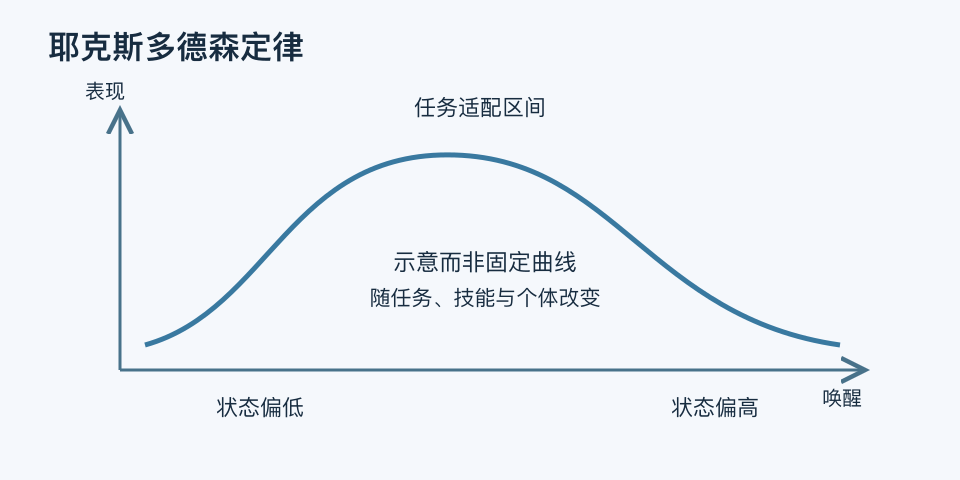

# 耶克斯多德森定律｜一分钟看懂

> 基于通用知识整理，尚未与视频内容核对。
> 内容类型：通用知识版

[返回主题](README.md) · [明细](明细.md) · [案例](案例.md)

越紧张就一定表现越好吗？耶克斯—多德森定律常用倒U形说明唤醒与表现的关系：过低或过高的唤醒都可能不利，合适状态还取决于任务与熟练程度。本稿采用常见心理学解释，同时保留其证据边界；它不是测出压力值就能算出绩效的公式。

- 唤醒涉及警觉与激活程度，不能简单等同于工作量或外部施压。
- 新任务、复杂推理与熟练动作对状态的要求可能不同。
- 同一个人的适宜状态也会随疲劳、准备程度与情境变化。
- 倒U图是概念示意，不能证明所有人都需要“适当焦虑”。

最简用法：在同类任务中记录自己的紧张感、出错情况和准备状态。太慌时先减少干扰、拆任务或补演练；太松散时明确小目标与反馈。比较几次结果，而不是依据一次发挥给自己贴标签。

原始研究涉及动物学习，日常压力管理是扩展应用。不要用这个名称为羞辱、威胁或长期超负荷辩护，也不要把持续困扰只归结为压力没有调到“最佳点”。
