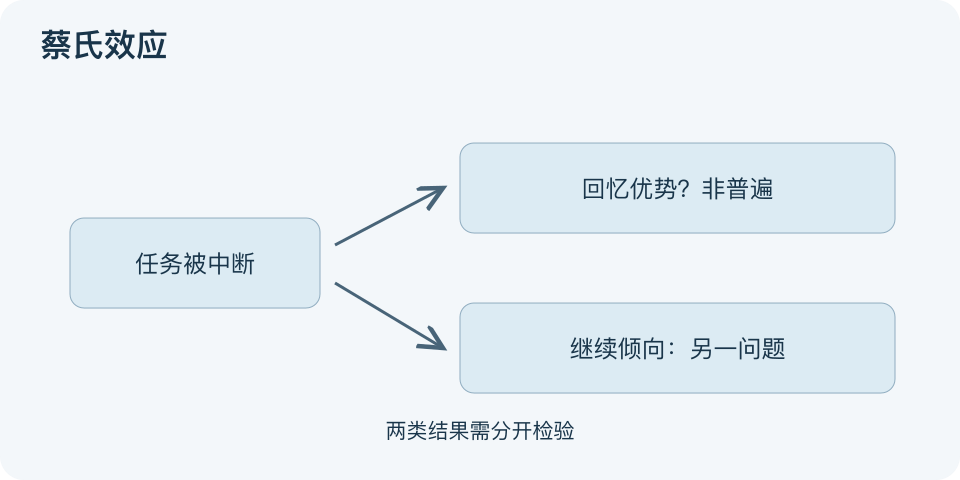

# 蔡氏效应：一分钟看懂

> 基于通用知识整理，尚未与视频内容核对。
> 内容类型：通用知识版

“没做完的事更难忘”常被称为蔡氏效应，即Zeigarnik效应。本文按未完成任务的记忆研究解释这个题名，不能认定视频采用完全相同的版本，更不能据此诊断一个人为何放不下关系。

- 原命题比较被中断与已完成任务的回忆表现。
- “记得更好”和“想接着做”是两种结果，后者通常另称Ovsiankina效应。
- 2025年元分析未支持未完成任务具有普遍记忆优势，情境与个体差异需要考虑。
- 未完成事项值得记录与安排，但这属于实践选择，不是实验定律的必然处方。

最简应用：把一件挂念的任务写成当前状态、下一步和恢复时间；恢复后检查能否继续，不靠刻意制造中断来保证记忆。图将中断后可能出现的回忆与继续倾向分开，表示不同研究问题。

误区是认为所有遗憾都由未完成造成，或故意留下悬念让别人依赖自己。记忆实验不支持这种人际承诺。对反复困扰，应具体看事件、需要和可行动范围，不能仅靠给现象贴一个心理学名字就解释完。

文字依据和适用边界见[明细](明细.md)。

[模型主页](README.md) · [明细](明细.md) · [案例](案例.md)
