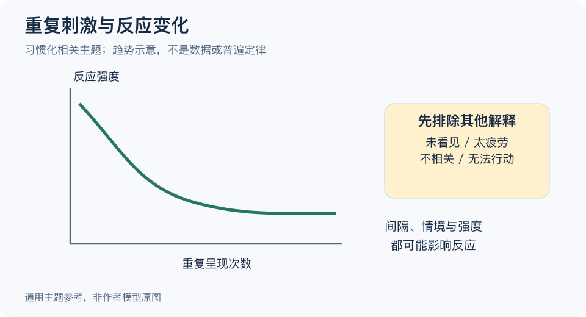

# 贝勃定律：一分钟看懂

> 基于通用知识整理，尚未与视频内容核对。
> 内容类型：主题参考版（原义待核实）
> 题名来源及定义尚未充分核实；本文采用“习惯化与反应变化”的参考主题，不将其等同于韦伯定律或所有情绪适应。

同一提示出现很多次，人可能越来越少注意；但这不表示事件变得不重要，也不表示所有痛苦或快乐都会按同样速度消退。这里先借用有研究定义的“习惯化”来讨论重复刺激与反应变化，同时保留“贝勃定律”的原义待核实状态。

- **分开刺激与反应。** 提示本身没有变化，人的回应仍可能改变；观察时要分别记录。
- **不要只看次数。** 强度、间隔、情境和当前状态都会影响反应，不能画一条下降线就当作普遍规律。
- **排除其他解释。** 没有反应可能是没看到、太疲劳、无法行动，未必是已经习惯。
- **注意恢复与变化。** 间隔一段时间或出现不同刺激后，反应可能改变，不是永久归零。

最简步骤：当重复提醒失效，先查是否送达、是否相关、是否可行动，再比较不同情境下的反应。根据问题减少无意义重复、改善信息内容，不能只不断加大刺激。

常见误区是把“我已习惯”解释成“它没有伤害”，或劝别人反复忍受不适。图仅作趋势示意，不是实验数据，也不是衡量个人情绪的预测公式。

[模型主页](README.md) · [明细](明细.md) · [案例](案例.md)
