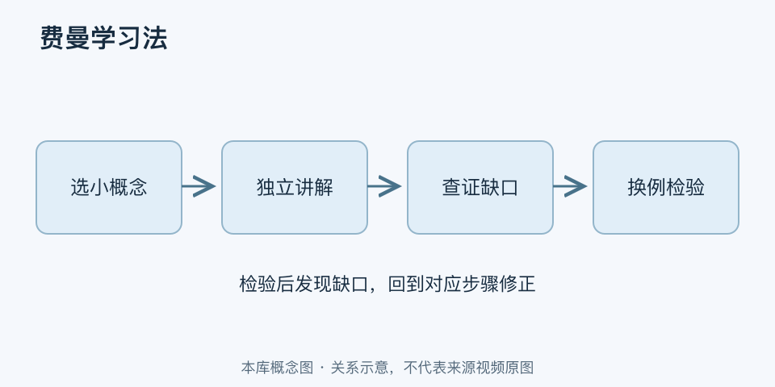

# 费曼学习法｜一分钟看懂

> 基于通用知识整理，尚未与视频内容核对。
> 内容类型：通用知识版

[返回主题](README.md) · [明细](明细.md) · [案例](案例.md)

看完一章觉得都懂，合上书却说不出为什么，费曼学习法就用来暴露这种差距。本稿采用常见的“选概念—尝试讲解—补缺口—重新解释”版本；它是以费曼命名的学习实践整理，不把网络四步法认定为费曼亲自发表的标准程序。

- 先选小问题，例如“为什么分母不同不能直接相加”，不要一次解释整门课。
- 不看资料，用自己的话讲清原因、条件和例子；卡住处就是下一轮学习入口。
- 回教材查证错误，特别检查类比在哪些条件下不成立。
- 换一道题检验理解，听众点头或讲得流畅都不足以证明掌握。

最简做法：用一页纸写下解释，圈出含糊词和跳步，查资料后重讲，再做一个陌生例题。下一次学习时先回忆这页内容，再决定是否补读。

它适合概念理解与知识组织，不能替代计算训练、实验或技能练习。不要为了“讲给小孩听”删掉关键限定，也不要反复润色一段错误解释。
