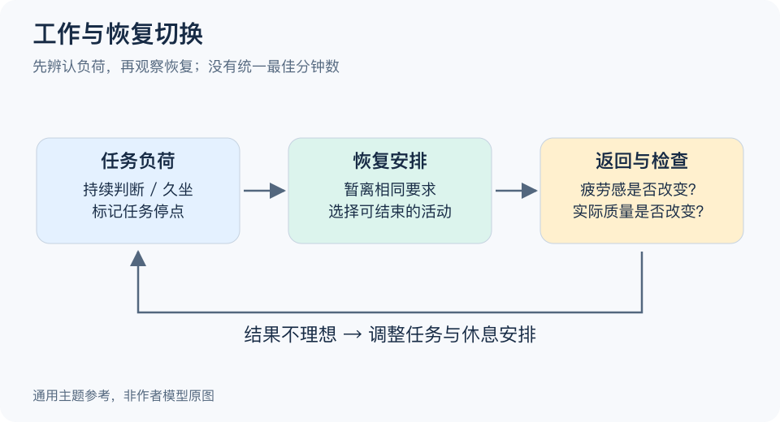

# 间态放松模型：一分钟看懂

> 基于通用知识整理，尚未与视频内容核对。
> 内容类型：主题参考版（原义待核实）
> “间态放松”的作者定义未核实。以下采用工作与恢复切换的参考主题，不把短休息研究等同于该模型。

连续处理复杂材料后，继续刷一屏信息未必算恢复。这个参考主题关注的不是“休息越久越好”，而是辨认刚才消耗了什么，暂时停止相同要求，再观察自己是否恢复。它帮助你把休息当作可调整的安排，而不是偷懒或万能提效技巧。

- **先看负荷。** 久坐、持续判断、社交应付带来的感受不同，不必用一种活动处理全部疲劳。
- **真正切开任务。** 回邮件、查看工作群仍可能延续原任务；给下一步留一句提示，再离开当前要求。
- **分开看感受与表现。** 感觉轻松不等于速度和准确率一定提高，二者需要分别观察。
- **保留返回入口。** 回来先做一个明确动作，避免休息结束后重新寻找上下文。

最简做法是：写下当前任务停在哪里，安排一段可结束的离开，回来比较主观疲劳和实际错误；若仍吃力，就调整安排或缩小任务。具体时长由情境决定，不存在本稿认可的统一“最佳分钟数”。

常见误区是把所有低强度活动都叫恢复，或者认为短休息能补偿长期睡眠不足。本稿只提供日常安排方法，也没有证明视频题名所指机制。

[模型主页](README.md) · [明细](明细.md) · [案例](案例.md)
