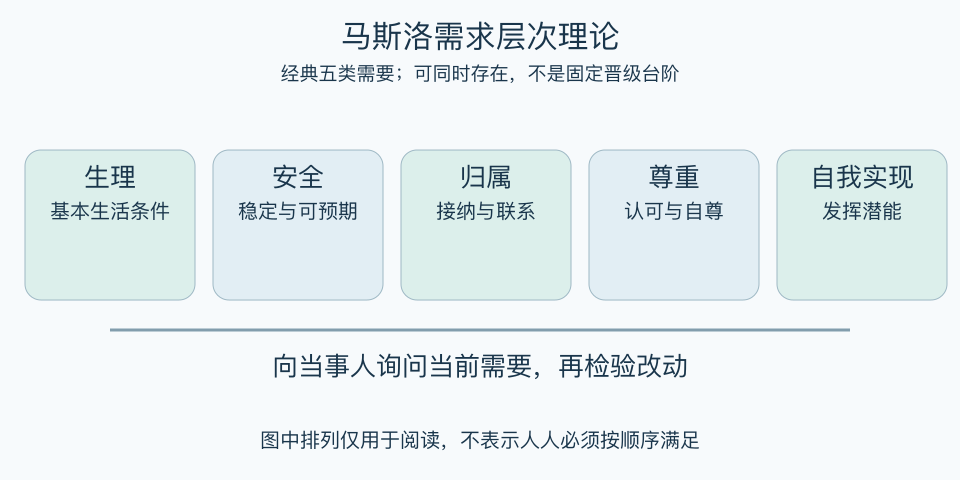

# 马斯洛需求层次理论：一分钟看懂

> 基于通用知识整理，尚未与视频内容核对。
> 内容类型：通用知识版

有人工作时无法专注，原因可能是疲惫、担心岗位变化，也可能是缺少尊重和成长机会。马斯洛需求层次理论提供一组观察动机的角度：生理、安全、归属与爱、尊重、自我实现。它帮助提出问题，不是把人装进固定等级。

- 同一个行为可能同时回应多种需要。
- 较基础需要未充分满足时，仍可能追求关系、创造与意义。
- “层次”不是每层必须百分之百完成后才能升级。
- 需要的重要性会随个人、文化与处境变化。

最简用法：围绕一个具体困扰，逐项问“这里有没有未被照顾的需要”，再直接听当事人描述。选择一个可改变的条件试做，如明确安排、改善休息条件或提供反馈，之后确认是否真的有帮助。

误区是给顾客、员工或自己判定“你还在低层”，或认为工资足够就不需要关心工作条件。本稿采用经典五类需要作讨论框架，不将其当作诊断、精确预测或普适晋级规律。

[模型主页](README.md) · [明细](明细.md) · [案例](案例.md)
