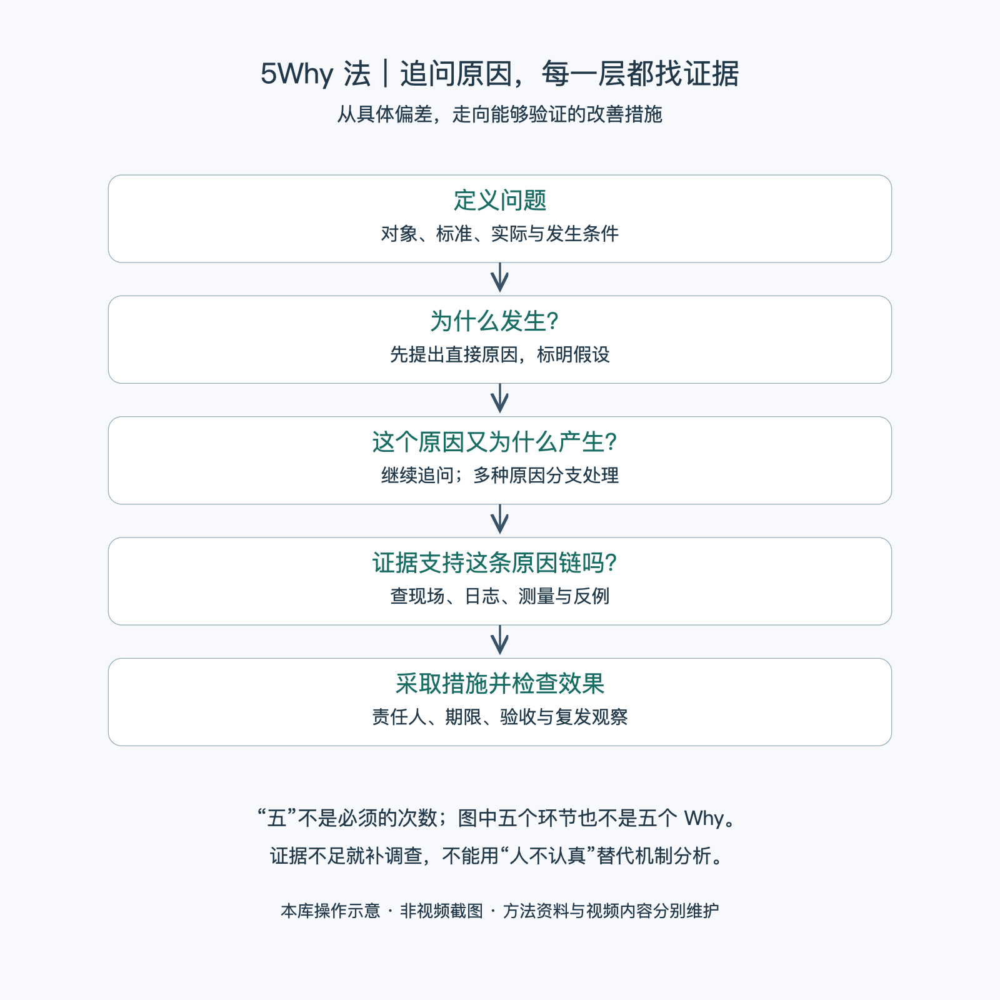

# 5Why法：一分钟看懂

> 通用知识版；[关联视频](https://www.bilibili.com/video/BV1C7JazfEdD/)已登记，尚未解析。文字依据见[明细](明细.md)。

5Why 法通过连续问“为什么会发生”，从表面现象追到有证据支持、可以采取措施的原因。重点是追问与核实，不是把同一句问题重复五次。

- **先说清问题。** 具体到对象、时间、地点、实际与标准的差距。
- **每问一次，都找证据。** 用现场记录、日志、测量或复现验证回答；猜测就标为待验证。
- **不必恰好问五次。** 可以少于或多于五次；出现多个原因时分支分析。
- **不止于“人不认真”。** 继续查行为发生的条件、信息、标准和防错机制。
- **原因要连接措施。** 明确负责人、完成时间、验收条件，并观察是否复发。

最简步骤：定义偏差 → 提出原因 → 找证据 → 继续追问或分支 → 验证措施 → 复查并更新标准。

例：工单为什么被反复退回？若回答“资料不全”，还要检查缺了什么、为何缺失、为何提交前未发现。每一层都需真实记录支撑，不能为了得到“系统应增加校验”而倒编原因。

六何法帮助把事情说完整；5Why 沿原因链深入；因果回路进一步解释问题如何在反馈作用下反复出现。

[模型主页](README.md) · [明细](明细.md) · [案例](案例.md)
