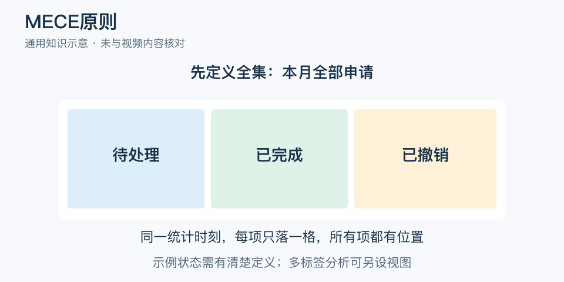

# MECE原则：一分钟看懂

> 基于通用知识整理，尚未与视频内容核对。
> 内容类型：通用知识版

把支出分成“餐饮、网购、交通”时，一笔网上订餐可能算进两类，房租又没有位置。MECE 要求在约定范围内分类互不重叠、合起来没有遗漏。它解决的是重复计算和漏项，并不保证分类后的判断正确。

- 先定义全集：分析哪些对象、哪段时间、按什么单位计数。
- 同一层用同一种划分依据，别把渠道与用途随意并列。
- 互斥要求同一项按该规则只落一处；穷尽要求每项都有归属。
- 未知可以单列，但不能让“其他”长期吞掉大部分信息。

最简应用是取几条真实记录逐一归类：是否有两处都能放，是否有无处可放？出现问题就修改边界或增加归类规则，再检查分类合计是否等于全集。

常见误区是要求世界上的事物彼此没有关系。一个问题可以有多个相互作用的原因，MECE 并不否认因果联系。多标签检索也可能故意允许重叠。要先区分“为统计分桶”与“描述真实关系”，不要为了表格整齐而切断重要信息。

文字定义与适用边界参见[明细](明细.md)。

[模型主页](README.md) · [明细](明细.md) · [案例](案例.md)
