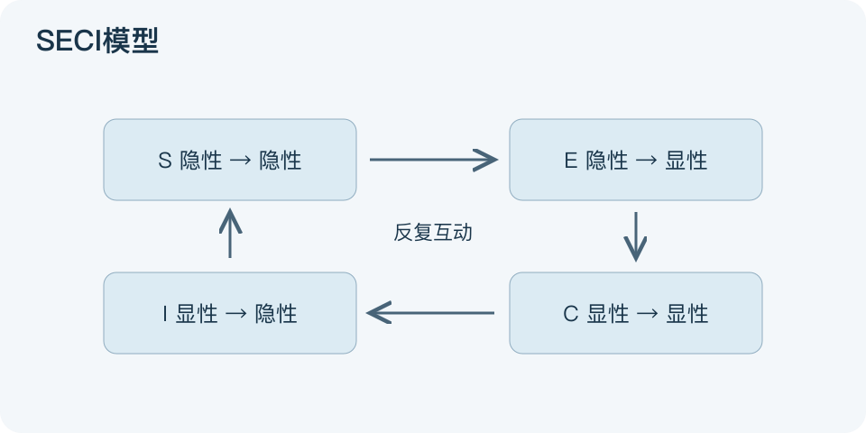

# SECI模型：一分钟看懂

> 基于通用知识整理，尚未与视频内容核对。
> 内容类型：通用知识版

老师傅知道机器声音哪里不对，新人却只拿到一本说明书。SECI讨论组织知识如何在经验与可表达资料之间流动：社会化、外化、组合化、内化。本文采用Nonaka的知识创造框架。

- S社会化：通过共同实践分享隐性经验，隐性到隐性。
- E外化：把经验说成概念、示例或规则，隐性到显性。
- C组合化：整合已有资料形成结构，显性到显性。
- I内化：在实践中把资料转为自己的判断与技能，显性到隐性。

最简应用：选一个难传的技能，让新人跟着做；请熟手解释判断依据，整理成可用指南，再让新人独立练习并反馈。图的四块分别代表转换类型，不代表只要按顺序开四次会就自动拥有组织知识。

隐性知识并不总能完整写下来，文件也可能过时。误区是把知识管理等同上传文档，或把经验分享当成所有人都已会做。检查应落在新人能否处理真实任务、何处仍需求助，而不是文档数量。

文字依据和适用边界见[明细](明细.md)。

[模型主页](README.md) · [明细](明细.md) · [案例](案例.md)
