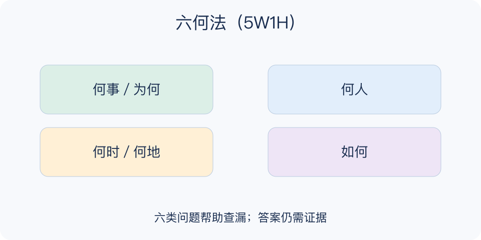

# 六何法（5W1H）：一分钟看懂

> 基于通用知识整理，尚未与视频内容核对。
> 内容类型：通用知识版

**版本与边界：** 采用What、Why、Who、When、Where、How六类问题；不把5W1H与连续追问原因的“五个为什么”混为一谈。

“尽快把活动安排好”看似交代了工作，其实对象、期限和做法都不清楚。六何法用何事、为何、何人、何时、何地、如何六个视角补齐信息，让问题描述或行动说明达到别人能接手的程度。

- 何事与为何：界定要解决的问题和目的，避免只有动作没有理由。
- 何人与何时：说明责任、参与者、期限和关键先后关系。
- 何地：交代发生范围、场所或线上渠道，不限于地理地址。
- 如何：说明步骤、资源、约束及判断完成的方法。

先用一句话描述任务，再逐项检查六个问题，把不知道的地方明确标记，并指定获取信息的人。最后请接手者用自己的话复述，检查是否仍存在两种理解。

六格填满不等于事实正确。“为何”中的猜测要与已证实原因区分；涉及预算时可额外补“多少”，不必为了保持六项而漏掉关键约束。

可交付的结果是一段别人能据以行动的说明，而不是六个只有名词的格子。让接手者说出第一步、截止点与求助对象，能快速暴露看似完整但仍无法执行的信息缺口。

文字依据见[明细的参考资料](明细.md#文字参考)。

[模型主页](README.md) · [一分钟看懂](一分钟看懂.md) · [明细](明细.md) · [案例](案例.md)
