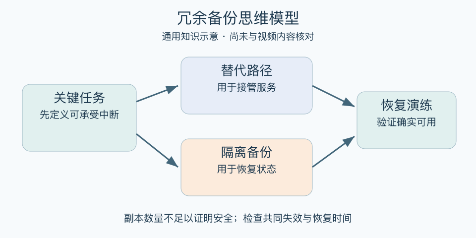

# 冗余备份思维模型：一分钟看懂

> 基于通用知识整理，尚未与视频内容核对。
> 内容类型：通用知识版

电脑坏了之后才发现，所谓“备份”只是同一块硬盘里的另一个文件夹。冗余备份思维关注：关键资源失效时，是否有真正可用的替代，并能在需要的时间内恢复。复制数量只是起点，独立性和恢复能力才是重点。

- 先识别不能中断或不能丢失的对象。
- 备份不能与原件轻易一起失效。
- 区分恢复旧状态的备份与维持服务的冗余。
- 定期试恢复，检查权限、版本和完整性。

最简用法：选一个重要文件或关键工作，写出失效原因、可接受损失、恢复办法与负责人。准备隔离的副本或替代路径，实际演练一次。只看到“备份成功”提示，不足以确认能恢复。

误区是所有东西都备三份、忽视维护成本，或以为实时同步能应付误删和勒索。同步也可能同步错误；两套系统共用电源、账号或地点，仍可能同时失效。该思维要减少关键单点，而不是无止境囤积。

[模型主页](README.md) · [明细](明细.md) · [案例](案例.md)
