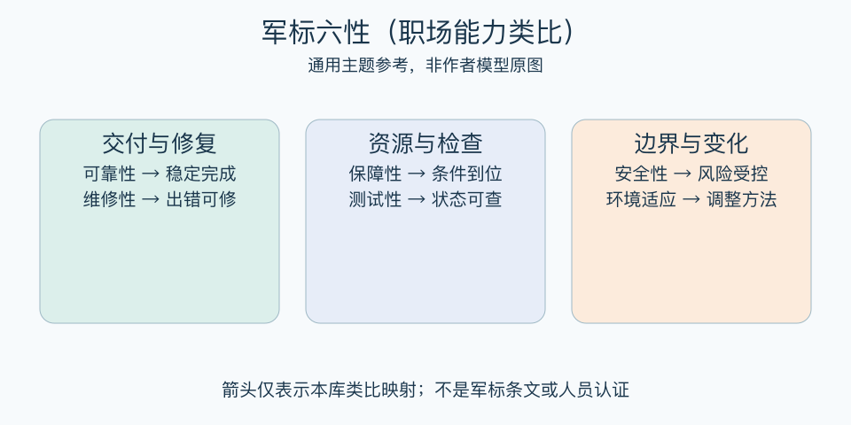

# 军标六性（职场能力类比）：一分钟看懂

> 基于通用知识整理，尚未与视频内容核对。
> 内容类型：主题参考版（原义待核实）

> 题名定义待核实；以下为相关主题参考，不代表该模型或作者观点。本稿采用可靠交付的六维职场自查，不是军用标准解释。

一个人偶尔把任务做得漂亮，不等于团队能持续依赖他的交付。本稿把可靠交付拆成六个检查角度：稳定完成、出错可修、资源有保障、状态可检查、风险受控制、变化能适应。这是本库的职场类比，不是军用标准条文或视频作者的能力体系。

- 看持续表现，不以一次高光代替稳定性。
- 出错后能定位、修复与交接，而不是靠个人硬扛。
- 提前备齐权限、资料和替补等条件。
- 保留检查证据，同时明确不可突破的边界。
- 环境变化时调整方法，不能把适应理解为无限承受。

最简用法：挑一项反复交付的任务，逐项找最脆弱处，只先改一个机制，如增加复核样例或写清交接说明。观察同类问题是否再次发生，再决定下一项改进。

误区是把人当设备，用“可靠”要求永不出错或随叫随到。类比只能帮助设计工作条件；人员评价还应考虑负荷、支持和公平，不能冒充标准认证。

[模型主页](README.md) · [明细](明细.md) · [案例](案例.md)
