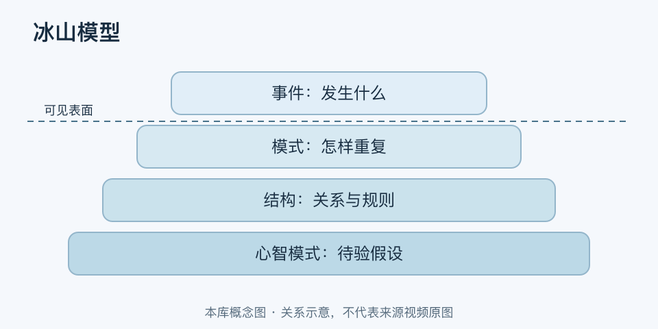

# 冰山模型｜一分钟看懂

> 基于通用知识整理，尚未与视频内容核对。
> 内容类型：通用知识版

[返回主题](README.md) · [明细](明细.md) · [案例](案例.md)

同一种故障每周重演，只修这一次，往往看不到反复发生的条件。冰山模型用可见表面与不易看见的部分提醒人深入分析。本稿明确采用系统思维的四层版本：事件、模式、结构、心智模式；不是人格或萨提亚沟通语境的冰山，也不能认定与来源视频相同。

- 事件：这一次具体发生了什么，先保留事实。
- 模式：相似事件怎样随时间反复，有没有例外。
- 结构：流程、资源、反馈和规则如何共同产生这些模式。
- 心智模式：哪些信念与假设支持现有安排，仍需验证。

最简用法：从一个事件收集历史记录，找重复条件，再提出可检验的结构解释，尝试一处改变并观察。紧急问题仍先处置，不必等到“挖到最深层”才行动。

水下部分不是自动更真实，不能凭一个人的行为猜测其潜意识，也不要硬套“表面只占百分之十”。层次是提问工具，不是证据。能提出不同解释、找到反证并验证机制，才算向下看了一步。
