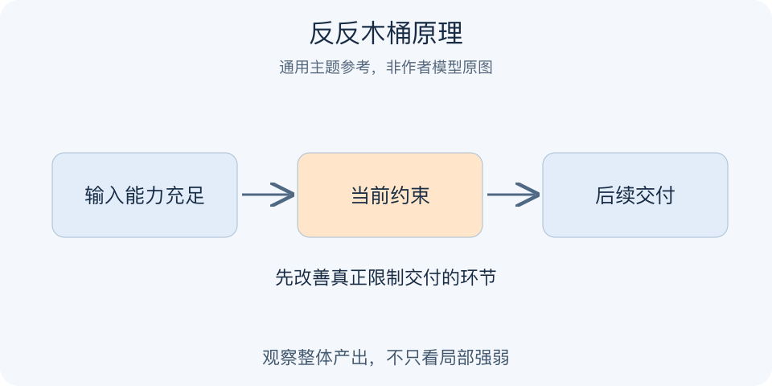

# 反反木桶原理｜一分钟看懂

> 基于通用知识整理，尚未与视频内容核对。
> 内容类型：主题参考版（原义待核实）

题名定义待核实；以下为相关主题参考，不代表该模型或作者观点。实际参考主题：系统约束、短板与优势的条件判断。

一条流水线变慢，究竟要补最弱环节，还是把最强环节做得更强？仅凭木桶比喻无法决定。本页用约束管理作主题参考：先看系统要交付什么、各环节怎样依赖，再判断哪个限制真正影响整体结果。“反反”这一作者限定未获得文字证实，不将它改名为普通木桶原理。

- 某项能力弱，不代表它正在限制目标。
- 串行依赖与可以分工替代的任务要分开。
- 优势值得发挥，但无法自动补偿必要底线。
- 解除一个约束后，限制可能转移到别处。

最简应用：画出交付链，标出等待和返工位置，选一个限制做小范围改善，观察整体交付是否变化。若只改善局部指标，应重新识别约束。误区是把同事称为短板，或不问目标就断言“补短板永远错”“扬长避短永远对”。这些口号都省略了关系结构和证据。

判断依据可以很朴素：改善这个环节以后，最终使用者是否更快得到合格结果？若答案未知，就暂时不要把它认定为决定性短板。

---

[来源入口](README.md) · [明细](明细.md) · [案例](案例.md)
