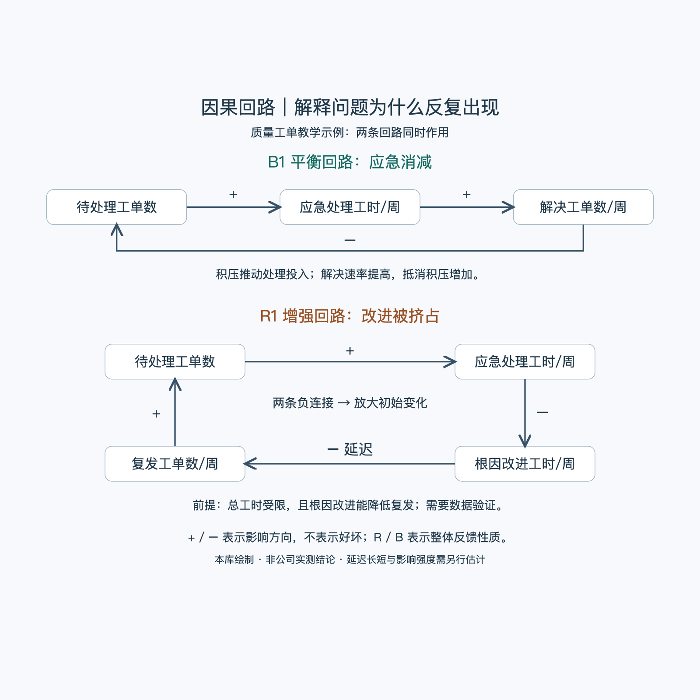

# 因果回路：一分钟看懂

> 通用知识版；未关联来源视频。图为假设教学示例，符号与来源见[明细](明细.md)。

因果回路把“变化怎样经过一连串影响，又回到自身”画出来。它适合分析为什么问题越忙越多、改进为何迟迟不见效，以及短期有效的措施会不会带来长期副作用。

- **变量：**用可增减的量，例如待处理工单数、每周解决工单数；不用“加强管理”这类行动口号。
- **箭头与正负号：**表示其他条件不变时的影响方向。`+` 表示让下游比原本更高，`−` 表示让下游比原本更低，不表示好坏。
- **增强回路 R：**反馈放大最初的变化，既可能形成增长，也可能形成恶化。
- **平衡回路 B：**反馈抵消最初的变化；有延迟或能力限制时，不保证平稳达到目标。
- **延迟：**标出从行动到效果的等待时间，防止把“尚未见效”判断成“无效”。

图中，积压增多会促使团队加大处理投入，解决速度提高后积压下降，构成 B 回路。若应急处理同时挤占根因改进，后续复发可能增加并再次推高积压，构成另一条 R 回路。两者可以同时存在。

最简步骤：明确反复出现的问题 → 定义变量 → 标注影响方向 → 找闭合回路和延迟 → 检查证据 → 选择干预并观察结果。

汇报时用它支撑“原因”与“行动”：先讲目标和实际差距，再讲反馈机制、关键证据、改进动作及需要的决策。

[模型主页](README.md) · [明细](明细.md) · [案例](案例.md)
