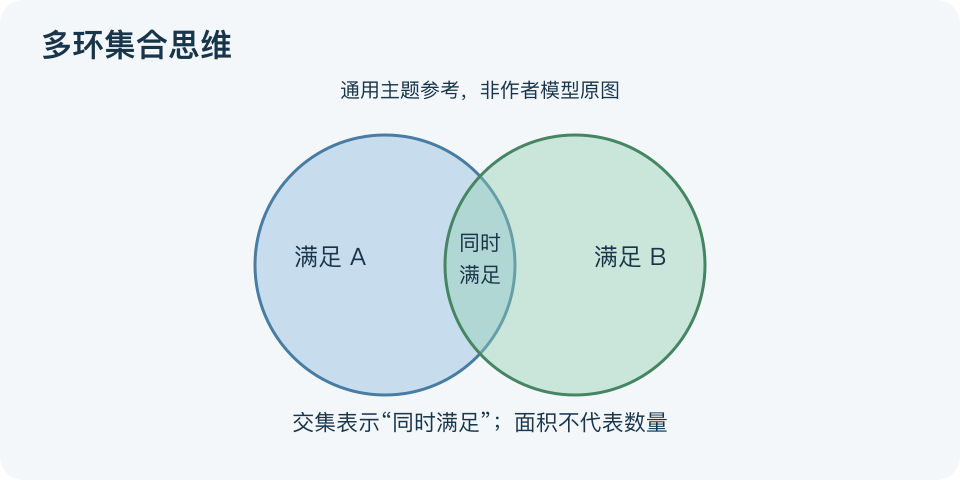

# 多环集合思维：一分钟看懂

> 基于通用知识整理，尚未与视频内容核对。
> 内容类型：主题参考版（原义待核实）
> 题名定义待核实；以下为相关主题参考，不代表该模型或作者观点。

想租一间便宜、近公司、又安静的房子，可以把每个条件视作一组候选房源，寻找同时满足条件的交集。题名“多环集合思维”的原定义尚未核实，本文仅提供集合关系与约束取舍的通用参考。

- 先定义全集：正在考虑的真实选项，而非无限想象。
- 交集表示“同时满足”，并集表示“满足至少一个”；两者不能混用。
- 必要条件决定可行性，偏好条件决定排序，别全写成一票否决。
- 条件越多，交集不会因此变大，但它可能保持不变，并非必然空集。

最简应用：列候选项，逐项检查必要条件，再对可行项比较偏好。图中的两个环分别代表满足A、满足B的选项，重叠区是同时满足，不重叠不等于选项没有价值。

如果交集为空，先查数据和条件定义，再决定扩大搜索、调整预算或放松偏好；不可擅自放松安全要求。图的圆圈面积没有统计含义，除非另有数据。误区是从几只相交圆推导人生必定得失守恒，或者因为画了交集就认定现实一定有完美方案。

文字依据和适用边界见[明细](明细.md)。

[模型主页](README.md) · [明细](明细.md) · [案例](案例.md)
