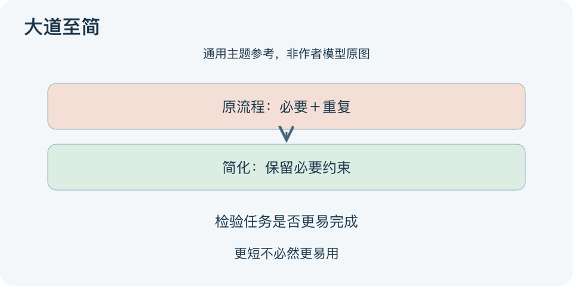

# 大道至简：一分钟看懂

> 基于通用知识整理，尚未与视频内容核对。
> 内容类型：主题参考版（原义待核实）
> 题名定义待核实；以下为相关主题参考，不代表该模型或作者观点。

把一份流程删到只剩一句话，可能更难执行。题名“大道至简”不足以确定作者的特定框架，本文采用“在保留必要信息与约束的前提下简化”的通用方法论参考，不把口号当成严格定律。

- 先明确任务，才能判断什么是多余；短并不自动等于好。
- 删除重复和无用步骤，保留会改变判断的条件、例外与风险。
- 把复杂性放在合适位置，例如主流程简明，例外有可找的说明。
- 用实际使用检验：别人是否更容易完成任务，错误是否增加。

最简应用：选一个具体流程，标出每步服务的目的；试删一项疑似冗余，观察完成、出错与求助情况，必要时恢复。图中简化前后都保留“必要约束”，表示减少的是干扰，而不是任意降低标准。

误区是把不能理解的内容直接省掉，或声称所有复杂问题背后只有一个原因。简单表达可以容纳复杂事实，但需要认真选择结构。没有证据支持把某句现代口号直接归为古籍原文，本文也不作这种作者归属。

文字依据和适用边界见[明细](明细.md)。

[模型主页](README.md) · [明细](明细.md) · [案例](案例.md)
