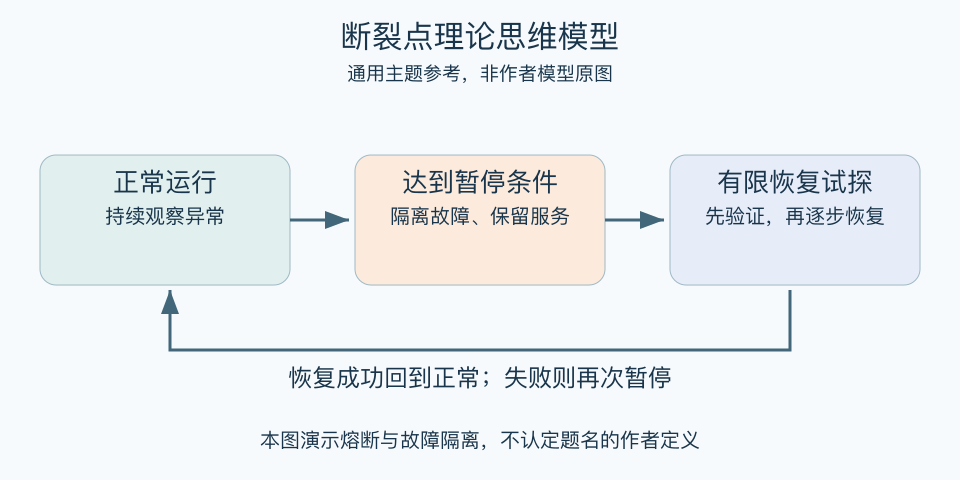

# 断裂点理论思维模型：一分钟看懂

> 基于通用知识整理，尚未与视频内容核对。
> 内容类型：主题参考版（原义待核实）

> 题名定义待核实；以下为相关主题参考，不代表该模型或作者观点。本稿参考主题：熔断、暂停机制与故障隔离；不采用地理学同名定义。

一个外部服务连续失败，如果系统仍不断重试，局部问题可能拖垮更多功能。本页采用“熔断与故障隔离”作相关主题参考：达到预设条件时暂停高风险连接，保护其他部分，恢复后再有限试探。题名也存在地理学等同名概念，不能据名称直接认定作者原义。

- 先明确保护什么，避免为维持局部而损害整体。
- 触发条件必须可观察，并考虑误触发的代价。
- 暂停期间要有替代服务、说明或有序退出。
- 恢复需要证据与试探，不能一恢复就全量压回。

最简用法：为一个容易扩散的故障，写下异常信号、暂停动作、通知对象及恢复条件。先在小范围演练，检查暂停是否真的保护了关键任务。生活中也可类比为暂停追加承诺，但不得把人际关系随意当作可熔断零件。

误区是出现一次不顺就永久放弃，或没有恢复机制地一刀切。保护机制本身也会失败，需要监测、维护与清楚的边界。

[模型主页](README.md) · [明细](明细.md) · [案例](案例.md)
