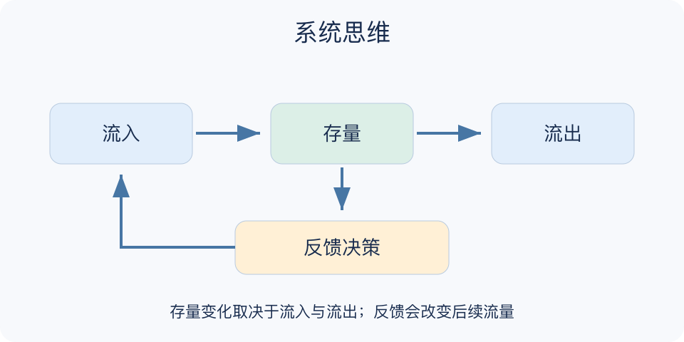

# 系统思维：一分钟看懂

> 基于通用知识整理，尚未与视频内容核对。
> 内容类型：通用知识版

**版本与边界：** 采用系统动力学常见的边界、存量、流量、反馈与时滞视角；系统思维是方法家族，本稿不宣称覆盖全部流派。

客服积压时只要求大家加速，可能让错误增加，返工又制造更多积压。系统思维把问题放进关系和时间中观察：哪些数量在积累，什么让它增加或减少，行动如何绕一圈回来影响原问题。

- 划边界：说明在分析谁、什么时间范围和哪些外部条件。
- 辨存量流量：积压是存量，每天新增与完成是流量。
- 查反馈：强化回路放大变化，平衡回路抵消偏差。
- 看时滞：措施与效果之间的等待，可能导致过度调整。
- 验结构：图上的箭头只是机制假设，需要数据和现场知识。

先画一个关键存量及其流入、流出，再补一个影响流量的反馈。选择小范围干预，同时观察目标结果、延迟影响和副作用，逐步修正关系图。

“一切相互联系”并不是分析完成；边界无限扩大只会让人无法行动。也不能把相关性画成因果箭头，再用这张图当作因果证明。

最小产物是一张有边界的小图，加上每条连接的证据或疑问。先解释一个反复出现的现象，比画出所有可能因素更有价值；模型能被事实修正，才有学习作用。

文字依据见[明细的参考资料](明细.md#文字参考)。

[模型主页](README.md) · [一分钟看懂](一分钟看懂.md) · [明细](明细.md) · [案例](案例.md)
