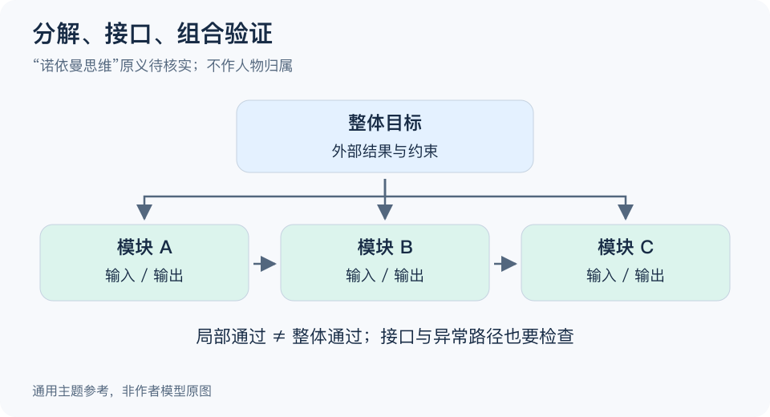

# 诺依曼思维：一分钟看懂

> 基于通用知识整理，尚未与视频内容核对。
> 内容类型：主题参考版（原义待核实）
> 名称保留原题用字；以下采用“分解、接口、组合验证”的系统分析参考，不将此名称归为冯·诺依曼提出的正式理论。

复杂任务可以拆成若干部分，但“每一部分都正常”还不保证整体正常。这个参考主题强调同时看部件、连接和整体目标：先分解到能理解的程度，再检查各部分怎样组合，而不是只把问题切得越来越碎。

- **从整体结果开始。** 先说清要完成什么，再决定怎样分块，避免按已有部门随意切分。
- **接口也是任务。** 数据格式、交接条件、等待时间和责任边界，可能比部件内部更容易出问题。
- **逐层验证。** 小部件、相邻组合和完整流程都需要检查，不能跳过集成。
- **保留反馈。** 整体表现不达标时，既查部件，也查相互影响和原先的分解方式。

最简步骤：把一个任务画成少量模块，为每个模块写输入、输出和成功条件，再沿一条完整路径检查交接。发现多个模块互相等待，就回头调整接口或拆分方式。

常见误区是相信复杂一定只是简单相加。强耦合、反馈和环境变化可能让整体出现部件单独没有的行为。图是帮助分析的结构示意，不证明原题名有统一科学定义，也不是任何人物的原始架构图。

[模型主页](README.md) · [明细](明细.md) · [案例](案例.md)
