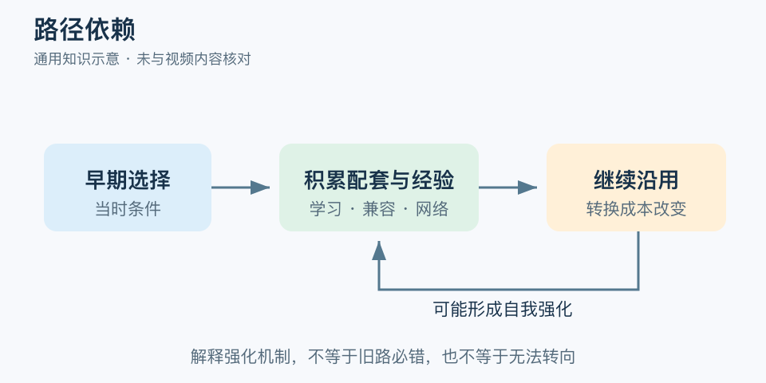

# 路径依赖：一分钟看懂

> 基于通用知识整理，尚未与视频内容核对。
> 内容类型：通用知识版

团队一直用旧系统，不一定只是“不愿改变”。早期选择可能带来培训、配套工具、客户习惯和协作网络，越用越难换。路径依赖描述的正是：过去的选择通过反馈与约束，影响今天哪些选择容易实现。

- 历史不只是背景，还可能改变后续选择的成本与收益。
- 学习积累、网络效应和转换成本可以形成自我强化。
- 留在原路不必然错误，稳定协作也有价值。
- 路径会限制选择，却不意味着永远无法转向。

最简应用是画出“当初为何选—后来积累了什么—现在换掉会失去什么”，再找一个能降低转换障碍的小动作，如开放导出、有限试点或保留兼容接口。比较从今天往后的收益与成本。

常见误区有两个：一是只凭“我们一直这样”就拒绝变化；二是看到旧方案就认定落后。已经花掉且不可收回的钱是沉没成本，未来必须支付的数据迁移和培训费用则是真实转换成本，两者不能混在一起。路径分析要找强化机制，而不只是讲一段历史故事。

文字定义与适用边界参见[明细](明细.md)。

[模型主页](README.md) · [明细](明细.md) · [案例](案例.md)
