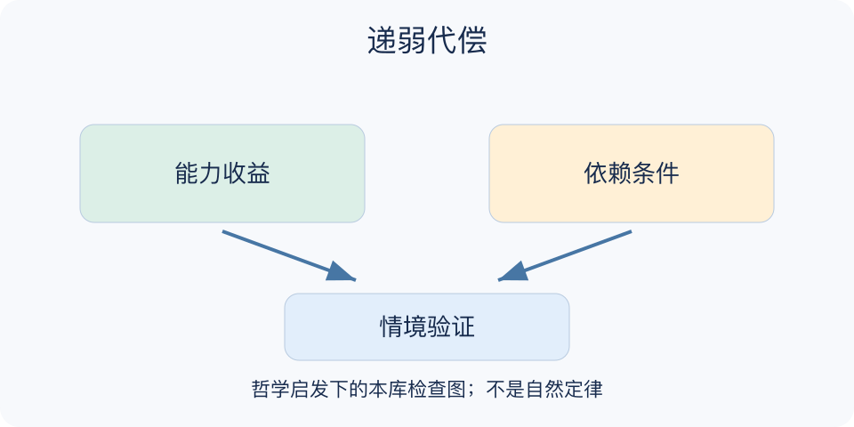

# 递弱代偿：一分钟看懂

> 基于通用知识整理，尚未与视频内容核对。
> 内容类型：通用知识版

**版本与边界：** 本稿介绍王东岳《物演通论》中的哲学主张，并将实际练习限定为本库整理的“能力与依赖检查”。哲学阐释不能当作经验科学定律，不能认定与视频讲法相同。

工具越强，是否就越不容易失效？“递弱代偿”在王东岳的哲学体系中，把存在稳定性的减弱与代偿属性的增加联系起来。阅读时应分清作者的解释框架和可检验的现实判断。对日常决策有用的入口，是追问一种能力增长依赖哪些条件，而非宣布复杂必然脆弱。

- 先辨主张：这是哲学解释，不是可直接代入数值的公式。
- 再看能力：新工具确实可能增加效率、范围和选择。
- 同时查依赖：电力、网络、维护者和规则可能成为新的前提。
- 最后做验证：具体依赖是否造成风险，应靠情境测试而不是类比断言。

选一项常用能力，列出它需要的外部支持，设想其中一项暂时不可用，记录还能完成哪些关键任务，再决定是否补充替代办法。

不要从“依赖增加”跳到“进化错误”或“文明必然衰退”；这些跨层推论需要独立证据，练习也不要求拒绝技术。

最小产物是一张两列清单：新增能力及其成立条件。每项条件后注明失效影响，才能分辨值得准备的关键依赖与无需过度防备的小不便。

文字依据见[明细的参考资料](明细.md#文字参考)。

[模型主页](README.md) · [一分钟看懂](一分钟看懂.md) · [明细](明细.md) · [案例](案例.md)
