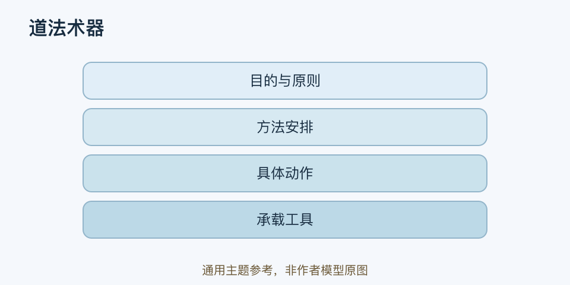

# 道法术器｜一分钟看懂

> 基于通用知识整理，尚未与视频内容核对。
> 内容类型：主题参考版（原义待核实）

> 题名定义待核实；以下为相关主题参考，不代表该模型或作者观点。实际参考主题：任务中目的、方法、动作与工具的一致性；四层工作定义为本库整理。

[返回主题](README.md) · [明细](明细.md) · [案例](案例.md)

买了新的笔记软件，学习仍没有进展，可能是工具与真正目标没有接上。本参考稿用“目的与原则—方法安排—具体做法—承载工具”四个层次检查这种错位，分别借用道、法、术、器作工作标签。它是本库的现代任务整理方式，不认定为古代经典中已有的统一四层模型。

- 目的与原则：要改善什么，哪些底线不能牺牲。
- 方法安排：按什么路径组织工作，为什么适合当前任务。
- 具体做法：下一步如何执行，怎样获得反馈。
- 承载工具：使用什么材料、设备或软件来完成操作。

最简用法：给一个任务写四行，检查每一行是否支持上一行；再从实际工具的限制往回看，必要时调整方法。买工具前，先说出它将帮助哪个具体动作。

四层不是价值高低或身份等级，也不是只能自上而下。工具可能扩展可行方案，操作反馈也可能暴露目标不合理。不要用抽象的“道不对”替代具体诊断，更不能声称一个现代术语表就是经典原义。
