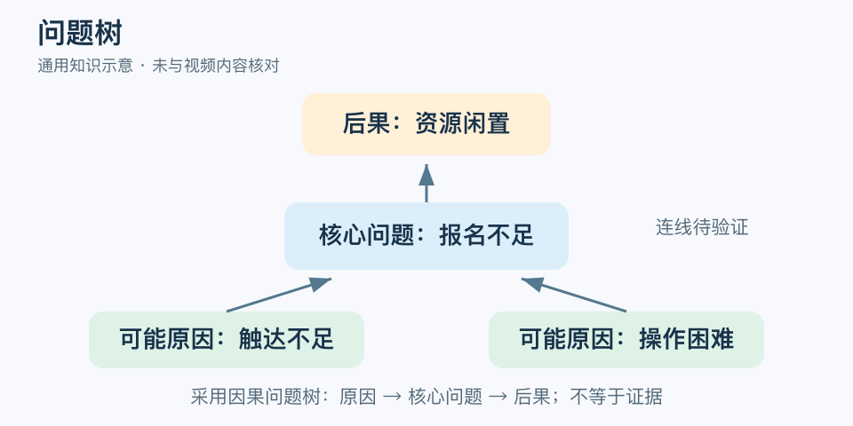

# 问题树：一分钟看懂

> 基于通用知识整理，尚未与视频内容核对。
> 内容类型：通用知识版

“活动报名少”是问题，“多发广告”已经是答案。问题树先把核心问题、可能原因和后果分开画出来，避免从一个症状直接跳到最熟悉的方案。本稿采用项目规划中“根部原因—树干问题—枝部后果”的因果问题树；咨询中的议题拆分树是另一种常见用法。

- 核心问题写可观察的现状，不把解决方案缺失当作问题。
- 原因回答为什么发生，后果回答发生后造成什么。
- 箭头表达待检验的关系，画上去不等于已经证明。
- 原因可以相互关联，复杂反馈不必硬压成单向树。

最简应用是把一个明确问题放中央，向下写两三类可能原因，向上写直接影响，再给每条关键关系标证据或未知。选择可影响、值得验证的一条做调查或试验。

常见误区是根越深越正确，或最后都归因于“意识不足”。无法观察、无法区分其他解释的叶子没有分析价值。问题树最有用的产物，是下一项要收集的数据和要验证的关系，而不是一张分支很多的图。

文字定义与适用边界参见[明细](明细.md)。

[模型主页](README.md) · [明细](明细.md) · [案例](案例.md)
