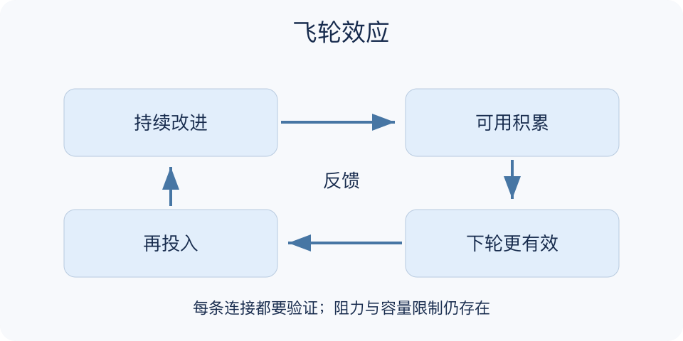

# 飞轮效应：一分钟看懂

> 基于通用知识整理，尚未与视频内容核对。
> 内容类型：通用知识版

**版本与边界：** 采用Jim Collins在《从优秀到卓越》中提出的组织积累比喻。下文反馈回路与指标表为本库操作整理，不把机械飞轮公式用于预测增长。

一项改进让下一项改进更容易，后者又为前者提供资源，这样的持续积累可用飞轮作比喻。飞轮效应提醒我们：显眼的突破可能来自此前多次同向努力，而不是一次神奇行动；但重复投入并不会自动形成有效循环。

- 同向积累：每轮工作要留下能力、资产或可信任的关系。
- 环节相接：写清本轮成果如何帮助下一轮，不能只画圆。
- 识别阻力：质量、容量和成本可能抵消积累。
- 保留验证：方向错误时应修正，不把坚持本身当成功证据。

挑一个目标，画出三到四个可观察环节，为每条连接写一句机制解释，再选择最弱的一环做小实验。复盘时同时看增益和维持这条回路的代价。

不要把增长、留存和收入连成圆就宣布飞轮成立；箭头需要证据。飞轮也不会永远加速，市场容量、服务负荷和资源约束都会改变结果。

最小产物应包含一项积累指标和一项成本指标，例如可复用知识是否增加、维护负担是否可承受。两者一起看，才能避免把忙碌和膨胀误认作长期能力增长。

文字依据见[明细的参考资料](明细.md#文字参考)。

[模型主页](README.md) · [一分钟看懂](一分钟看懂.md) · [明细](明细.md) · [案例](案例.md)
