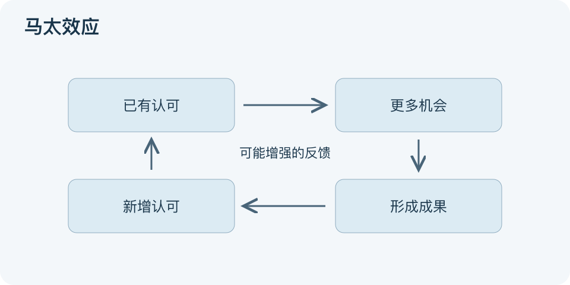

# 马太效应：一分钟看懂

> 基于通用知识整理，尚未与视频内容核对。
> 内容类型：通用知识版

两项贡献相近的工作，署上知名者的名字可能更容易受到注意。马太效应最初用于科学声望与奖励分配：已有认可会影响新的认可，形成累积优势；后来常被扩展讨论资源与机会的不均衡。

- 区分起点和能力：已有曝光、设备、导师关系会影响后续表现。
- 寻找反馈：成果带来关注，关注带来机会，机会又支持新成果。
- 看见分配规则：署名、推荐和资源评审会强化或削弱这种循环。
- 不把趋势当命运：优势可能衰退，新技术、制度和支持也可改变路径。

最简用法是画出“已有认可—获得机会—产生成果—更多认可”的环，再检查哪条连接有实际证据。对个人，可积累可展示的作品并争取反馈；对组织，可保留公开评审和新人的试手机会。

图表示一种可能的增强反馈，不表示富者必然更富，也不是投资收益公式。误区是把一切成功都归因于资源，或反过来认为领先者得到更多一定公平。分析机制和讨论分配是否合理，是两个需要分别回答的问题。

文字依据和适用边界见[明细](明细.md)。

[模型主页](README.md) · [明细](明细.md) · [案例](案例.md)
