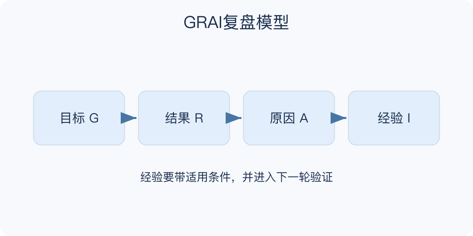

# GRAI复盘模型：一分钟看懂

> 基于通用知识整理，尚未与视频内容核对。
> 内容类型：通用知识版

**版本与边界：** 采用中文资料中的Goal、Result、Analysis、Insight版本，即回顾目标、评估结果、分析原因、提炼经验。缩写首创来源未确认，不能认定与视频步骤完全一致。

项目结束后说“沟通还要加强”，下次往往仍会遇到同样的问题。GRAI把复盘分成原先想达到什么、实际发生什么、差异为什么出现、哪些经验值得再试四部分，让总结从感想走向有证据的改进。

- 目标要回到事前记录：不能事后换标准证明自己成功。
- 结果既看达成也看代价：范围、质量和新增问题都要记。
- 分析区分事实与解释：相关变化不自动证明因果。
- 经验写出适用条件：把结论落实成下一次能验证的动作。

拿一个刚完成的小任务，对照事前目标列出实际结果，选择一个关键差异，找两种可能解释，再确定一个改进行动、责任人和回看日期。

复盘不是寻找背锅者，也不只总结失败。成功可能来自环境或运气，单次有效的做法不能未经检查就复制到所有场景。

最小产物可以只有一页：原目标、实际差异、证据较强的解释与下一轮行动。对尚未查明的原因保留疑问，比用一句“执行不到位”提前结束分析更能帮助后来的人。

文字依据见[明细的参考资料](明细.md#文字参考)。

[模型主页](README.md) · [一分钟看懂](一分钟看懂.md) · [明细](明细.md) · [案例](案例.md)
