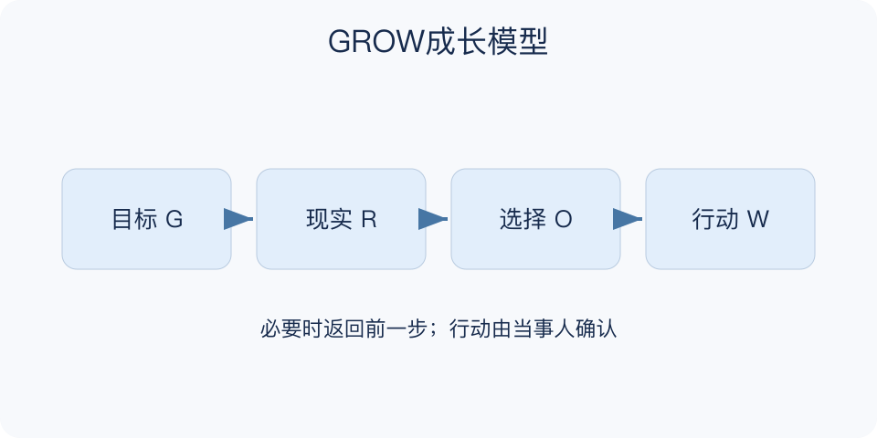

# GROW成长模型：一分钟看懂

> 基于通用知识整理，尚未与视频内容核对。
> 内容类型：通用知识版

**版本与边界：** 采用Goal、Reality、Options、Will版本，W指行动意愿与具体承诺；不是给人成长程度打分的模型。

朋友说“我想换一种工作状态”，立刻建议辞职可能太快。GROW先澄清目标，再了解现实，展开选择，最后落实行动。它常用于教练式对话，让当事人把模糊愿望转成自己愿意负责的下一步。

- Goal：这次谈话希望明确什么，长期想达到什么状态。
- Reality：目前发生了什么，哪些是事实、哪些是解释。
- Options：有哪些可行路径，暂不把第一个答案当唯一答案。
- Will：选择什么行动，何时做，需要什么支持。

拿一个可控的小目标，依次写出期望、当前证据、至少两种办法和一个有时间点的行动。若发现目标并非自己真正想要，可以返回第一步修改。

提问不能成为把对方引向预设答案的手段。缺少技能、权限或资源时，需要培训和支持，不能把未执行一概归为意愿不足。

一次对话的最小产物，是当事人能用自己的话说清选择及第一步。记录不必很长，但要包含准备何时开始、需要谁提供什么支持、届时根据什么判断该继续还是调整。

文字依据见[明细的参考资料](明细.md#文字参考)。

[模型主页](README.md) · [一分钟看懂](一分钟看懂.md) · [明细](明细.md) · [案例](案例.md)
