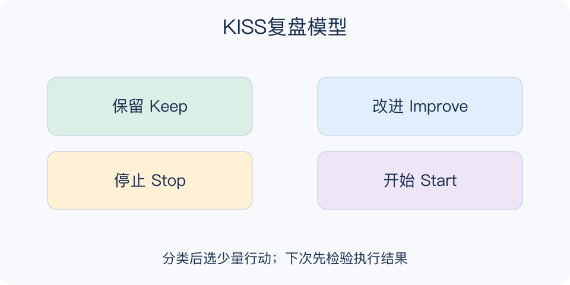

# KISS复盘模型：一分钟看懂

> 基于通用知识整理，尚未与视频内容核对。
> 内容类型：通用知识版

**版本与边界：** 采用Keep、Improve、Stop、Start四类复盘版本。两个S的排列在资料中有差异，本稿明确顺序；它不是Keep It Simple的软件设计原则。

复盘会列出一堆问题后，往往没人知道下周要改什么。KISS把现有做法和新想法分成保留、改进、停止、开始四类，既防止把有效做法一起推翻，也让改变有明确方向。这里的KISS指复盘分类。

- Keep保留：已经有价值的做法，写清保留什么及原因。
- Improve改进：方向可用，但某个环节需要调整。
- Stop停止：代价大于价值或不再必要的做法。
- Start开始：尚未实行、值得有限试验的新办法。

选一个明确周期，先各自写具体观察，再归到四类；讨论证据后只选一两项改变，明确负责人、开始时间和回看标准。不要为了填满四格而编意见。

分类不是原因分析。写“停止拖延”并没说明如何改变；也不能把KISS变成对人的去留投票。讨论对象应是行为、规则与流程。

最小产物不是四格都写满，而是保留有价值的做法，并确定少量能执行的改变。每项改变都要回答谁负责、什么时候开始、怎样检查；尚未选择的建议可以留待下一轮。

文字依据见[明细的参考资料](明细.md#文字参考)。

[模型主页](README.md) · [一分钟看懂](一分钟看懂.md) · [明细](明细.md) · [案例](案例.md)
