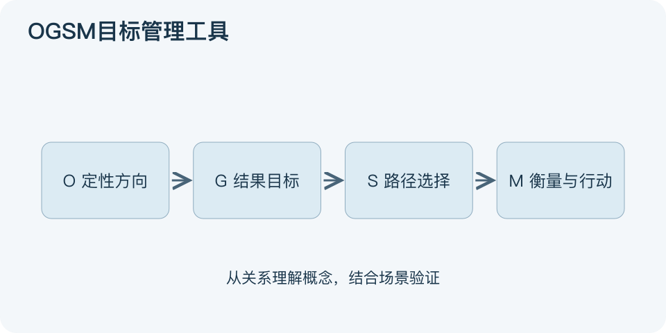

# OGSM目标管理工具：一分钟看懂

> 基于通用知识整理，尚未与视频内容核对。
> 内容类型：通用知识版

“成为优秀团队”不能直接安排下周工作。OGSM把方向与执行连起来：Objective是定性方向，Goals是可测的结果目标，Strategies是实现目标的选择，Measures是检查战略是否推进的衡量方式。

- O回答要成为什么样，避免只有口号而没有服务对象。
- G回答做到多少、何时完成，先确认基线和口径。
- S回答采取哪条路径，也意味着暂不做哪些事。
- M回答怎样跟踪；部分实践还在这里并列行动、负责人和日期。

最简应用是用一页纸写一个方向、少数结果、相应策略及检查指标，然后逐条追问：这个行动支持哪条策略，这条策略如何影响目标？找不到连接的项目应重新解释或移出计划。

本文采用常见的四部分版本，并明确“衡量+行动”属于实践扩展。不要把日常待办堆成战略，不要把开会次数当业务成功。图从方向走到衡量表示对齐关系；真实执行还需要反馈，目标不变时策略也可能调整，指标达成也不等于所有用户都受益。

文字依据和适用边界见[明细](明细.md)。

[模型主页](README.md) · [明细](明细.md) · [案例](案例.md)
