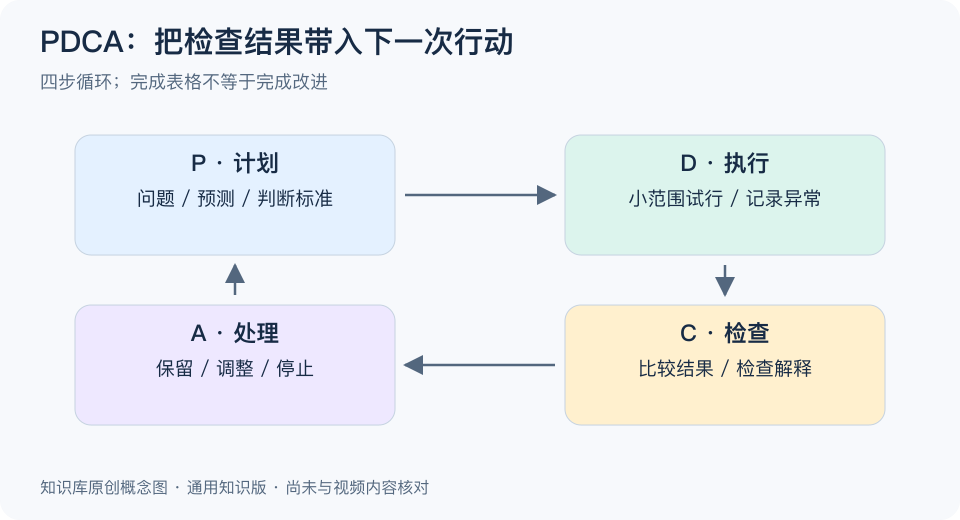

# PDCA 循环：一分钟看懂

> 基于通用知识整理，尚未与视频内容核对。文字来源见[明细](明细.md)。
> 内容类型：通用知识版

背单词总是记不住，换一本书不一定有用。先明确想改善什么，再试一种方法、检查结果、决定是否保留，才形成一次有反馈的改进。PDCA 就是把改进组织成“计划、执行、检查、处理”四步，并持续重复。

- **计划 P：** 写清问题、目标、尝试的改变及判断标准。没有标准，事后容易把任何结果都解释成成功。
- **执行 D：** 在可控范围内试做，记录过程与异常，避免同时改动太多因素。
- **检查 C：** 将数据与原定目标比较，区分结果、原因猜测和仍不知道的部分。
- **处理 A：** 有效就固化并谨慎扩大；无效就调整或放弃；证据不足则继续验证。

最简步骤是写下一句：“我预计做出某个改变后，某项指标会在某段时间内改善。”随后安排试行、检查日期与负责人，并把检查结论转成下一步动作。

常见误区是只做计划和执行，复盘后也不改流程。完成任务不等于完成循环；改善一次也不代表永久有效。PDCA 提供改进顺序，数据是否可靠、原因是否成立，仍要另外判断。

[模型主页](README.md) · [明细](明细.md) · [案例](案例.md)
