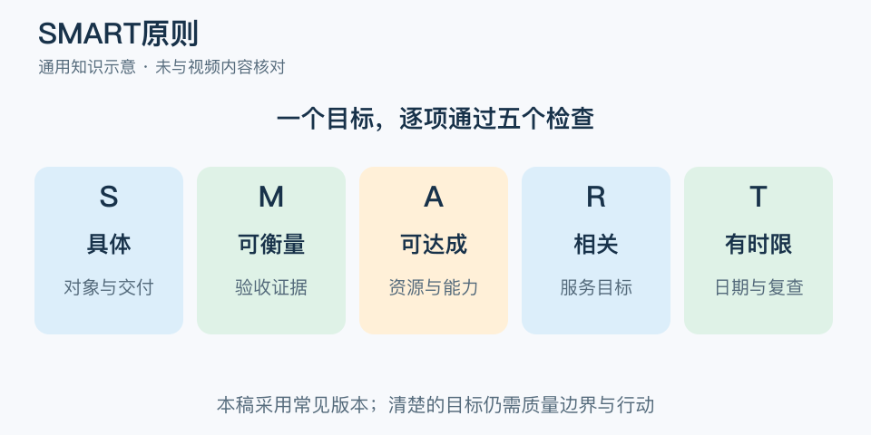

# SMART原则：一分钟看懂

> 基于通用知识整理，尚未与视频内容核对。
> 内容类型：通用知识版

“提高英语水平”表达了愿望，却很难安排今天做什么，也无法判断何时完成。SMART 是检查目标是否写清的五项标准。本稿采用当前常见版本：具体、可衡量、可达成、相关、有时限；不同资料中字母释义可能不同，不能认定视频采用同一版本。

- 具体：说明对象、行为或交付物，避免“加强”“做好”。
- 可衡量：给出可观察证据，不要求所有目标都变成单一数字。
- 可达成且相关：与资源、能力、上层目的相匹配。
- 有时限：写验收日期，也安排过程检查。

最简应用是把愿望改写成“谁在何时之前，在什么条件下完成什么，用什么证据验收”，再核对实现它需要的时间与支持。比如两周内独立完成一份练习报告，由同伴按事先约定的标准检查。

常见误区是指标越高越好，或目标写成 SMART 就必然达成。数字可以明确，却也可能引导刷量。要同时写质量底线、依赖条件和复查方式；若目标本身选错，五个字母只会让错误更精确。

文字定义与适用边界参见[明细](明细.md)。

[模型主页](README.md) · [明细](明细.md) · [案例](案例.md)
