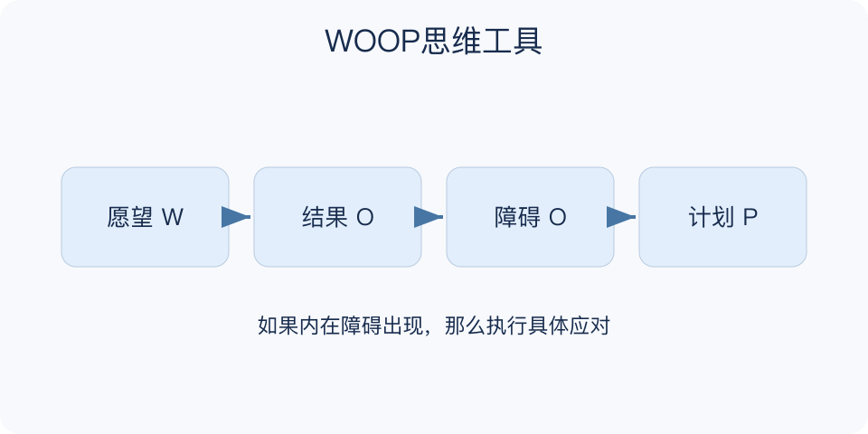

# WOOP思维工具：一分钟看懂

> 基于通用知识整理，尚未与视频内容核对。
> 内容类型：通用知识版

**版本与边界：** 采用Wish、Outcome、Obstacle、Plan版本，即愿望、最佳结果、内在障碍、如果—那么计划；依据WOOP官方文字指南。

只想象完成任务后的轻松，未必能让人开始。WOOP先选择一个重要且有挑战的可行愿望，想象实现后的最佳结果，再认真面对自己最主要的内在阻碍，最后为它准备一个具体的如果—那么行动。

- 愿望：限定时间，选择对自己有意义且有实现可能的事。
- 结果：体验实现愿望带来的最好感受或变化，确认它值得。
- 障碍：识别自己的习惯、情绪或想法如何挡住行动。
- 计划：如果障碍出现，那么我就做一个明确、可行的应对。

找几分钟安静时间，按四步完成一轮。把障碍写得具体到能被识别，再把应对缩成现场做得到的动作，完成后在实际情境中检验并调整。

障碍不只是“别人不配合”，也不是责备自己。外部资源确实缺乏时应处理现实条件；WOOP不能保证愿望实现，也不能替代专业支持。

一个合格计划应能在现场被想起并执行，例如出现反复准备的冲动，就先写一句粗稿。若触发条件只是“以后有困难”，范围太宽，应重新找到更可识别的内在信号。

文字依据见[明细的参考资料](明细.md#文字参考)。

[模型主页](README.md) · [一分钟看懂](一分钟看懂.md) · [明细](明细.md) · [案例](案例.md)
