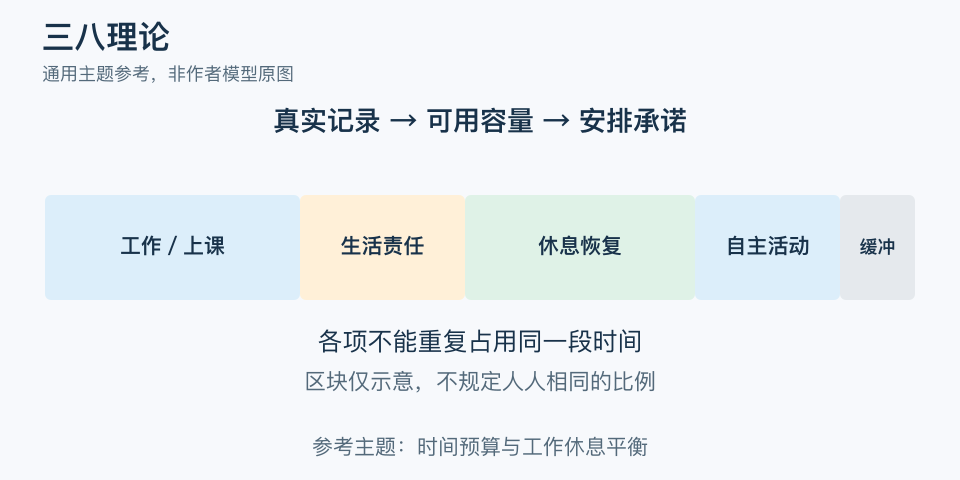

# 三八理论：一分钟看懂

> 基于通用知识整理，尚未与视频内容核对。
> 内容类型：主题参考版（原义待核实）

> 题名定义待核实；以下为相关主题参考，不代表该模型或作者观点。实际参考主题：时间预算与工作休息平衡。

“一天除去工作和睡眠，还剩很多时间”听起来简单，实际却漏了通勤、吃饭和照护。本稿实际讨论时间预算与工作休息平衡；题名“三八理论”的具体定义尚未确认，不把一天均分三段认作视频作者的原义。

- 先记录真实去向，区分有偿工作、生活责任、休息和自主安排。
- 一天的总时长有限，各项承诺不能重复占用同一段时间。
- 休息不是效率不足后的剩余项，日程需要留出恢复空间。
- 可支配时间因人而异，不能拿统一比例评判努力程度。

最简应用是记录三天，算清固定占用，再为一项重要但非紧急的事安排现实的小时间块，留出移动、切换和意外缓冲。忙碌日可以缩小计划，不必从休息中强行借时。

常见误区是宣称“人人都有八小时自由时间，成败全看如何利用”。这忽视照护、工作条件与精力差异。时间预算是一张核对承诺的账，不是成功公式；有关休息的具体需要也不能由三个八统一规定。

文字定义与适用边界参见[明细](明细.md)。

[模型主页](README.md) · [明细](明细.md) · [案例](案例.md)
