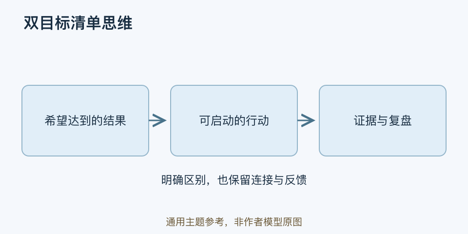

# 双目标清单思维｜一分钟看懂

> 基于通用知识整理，尚未与视频内容核对。
> 内容类型：主题参考版（原义待核实）

> 题名定义待核实；以下为相关主题参考，不代表该模型或作者观点。实际参考主题：结果目标与执行行动的衔接；两张清单是本库整理。

[返回主题](README.md) · [明细](明细.md) · [案例](案例.md)

愿望清单写得很完整，到了周一仍不知道该做什么，本参考稿用两张相连的清单处理这个问题：一张记录希望得到的结果，一张记录近期可执行的行动。原题名中的“双目标”规则尚未证实，不能认定视频说的就是这两张表。

- 结果清单描述希望发生的变化，并说明怎样知道有进展。
- 行动清单写自己能启动的具体行为、时间或触发情境。
- 每个行动都要连接一个结果，避免忙碌却没有方向。
- 结果受外界影响，行动完成也不保证结果出现，需要复盘两者关系。

最简用法：先挑一个当前重要结果，写一个本周可做的动作，例如“周二晚饭后整理三道错题”；到周末分开检查做了没有、是否接近目标。若没有效果，改策略，不只增加打卡次数。

这里借鉴目标意向与执行意向的区分，但两张清单是本库工具，并非相关研究的标准名称。它也不等于坊间流传的“二十五选五”名人故事。目标不该无限扩张，清单需考虑实际时间、依赖与休息。
