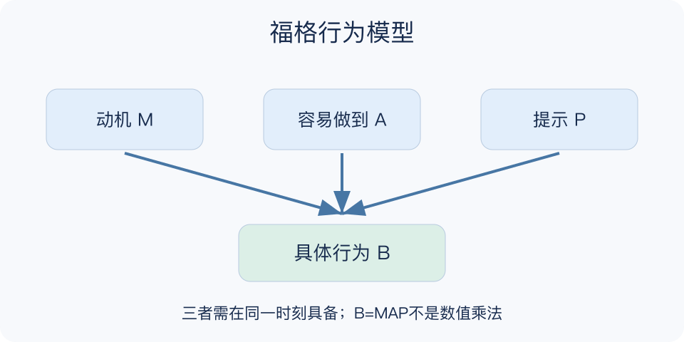

# 福格行为模型：一分钟看懂

> 基于通用知识整理，尚未与视频内容核对。
> 内容类型：通用知识版

**版本与边界：** 采用BJ Fogg官网的B=MAP版本：Motivation、Ability、Prompt；旧材料可能使用Trigger一词，本稿统一称“提示”。

想看书却始终没打开书，不一定是意志薄弱。福格行为模型把某个具体行为的发生放在同一时刻的三个条件下看：有多想做、做起来有多容易、是否出现了合适提示。B=MAP是一种概念表达，不是可算出概率的乘法公式。

- 动机：这件事对当下的自己是否值得做，可能随情境波动。
- 能力：这里关注当时是否容易完成，包括时间、精力与操作负担。
- 提示：提醒要发生在能够行动的时刻，并指向具体动作。
- 先缩小行为：把抽象目标变成能开始的一步，更容易定位阻碍。

选择一个明确动作，回看最近一次没做成的现场，分别检查三个条件。先尝试降低一个障碍，再安排恰当提示，用实际完成情况判断修改是否有帮助。

不停推送不能弥补任务太难；失败也不能全归因于动机。模型是行为设计视角，不支持对复杂人生结果作简单归责。

最小产物是一条明确行为和一处环境调整。先观察开始动作在哪里卡住，再判断是否需要训练、准备材料或更换时机；别用连续完成天数代替对具体阻碍的理解。

文字依据见[明细的参考资料](明细.md#文字参考)。

[模型主页](README.md) · [一分钟看懂](一分钟看懂.md) · [明细](明细.md) · [案例](案例.md)
