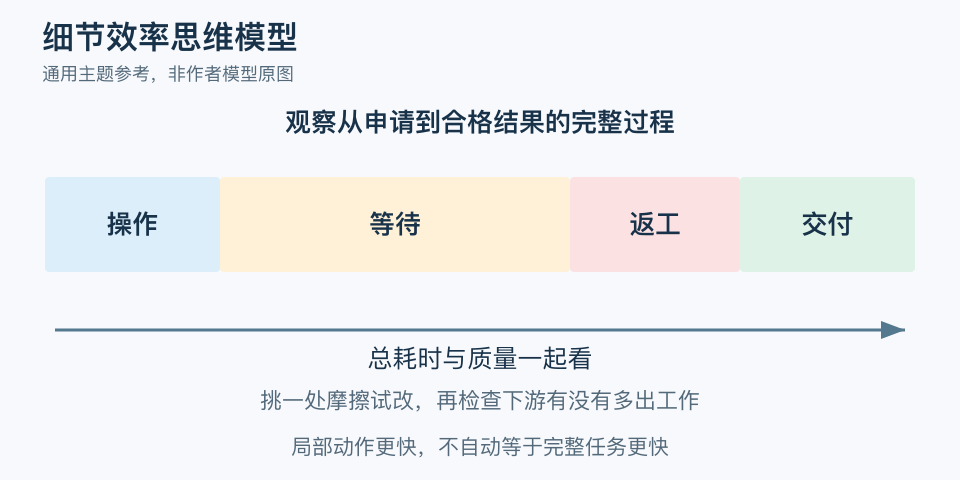

# 细节效率思维模型：一分钟看懂

> 基于通用知识整理，尚未与视频内容核对。
> 内容类型：主题参考版（原义待核实）

> 题名定义待核实；以下为相关主题参考，不代表该模型或作者观点。实际参考主题：流程观察与局部改进。

每天少点一次按钮，可能节约时间；但如果真正延误来自等待批准，优化按钮未必改善交付。本稿实际讨论流程观察与局部改进，题名模型的具体定义未核实，不把这些步骤说成作者原有框架。

- 先看完整任务怎样完成，再挑局部细节。
- 分清操作时间、等待时间和返工，不只数动作快慢。
- 优先处理反复发生、影响明显且能改变的摩擦。
- 同时检查质量和总耗时，避免局部变快、下游更忙。

最简应用是跟踪一次真实任务，记下各步开始、结束和等待，选一处小问题做可撤回的改动，再比较同类任务的完整结果。有用的改进可以写成短说明，让其他人也能执行。

常见误区是把效率理解为每个人都必须一直忙，或为了少一步而取消必要检查。标准化也不是永久冻结：条件变化后应更新。小细节只有与实际目标和流程关系相连，才值得投入；精致但无影响的优化同样可能耗费时间。

文字定义与适用边界参见[明细](明细.md)。

[模型主页](README.md) · [明细](明细.md) · [案例](案例.md)
