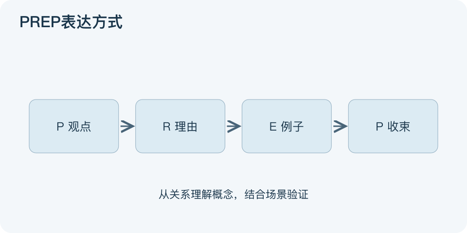

# PREP表达方式：一分钟看懂

> 基于通用知识整理，尚未与视频内容核对。
> 内容类型：通用知识版

被问“你建议怎么做”时，先把所有背景倒出来，听众可能等不到答案。PREP按Point、Reason、Example、Point组织简短表达：先给观点，再说理由，用例子支撑，最后收束到观点或行动。

- 观点是一句能讨论的判断，不只是主题名。
- 理由说明为何采取这个判断，别仅把观点换词重复。
- 例子把理由具体化；个案可帮助理解，不能自动证明普遍规律。
- 结尾重申适用范围或下一步，不必逐字再念开头。

最简做法是写四句：我建议什么，因为哪个主要理由，例如什么情况，因此现在请做什么。图的四步表示听众接收论证的顺序，不表示结论在搜集证据之前就应固定。

本文采用常见的即兴表达版本。适合短汇报、回答建议类问题；复杂争议可拆成多个论点并提供完整证据。误区是开头强下结论，随后只挑支持自己的例子。若资料不足，可以把观点说成“建议先验证”，清晰表达也包括清晰承认不确定。

文字依据和适用边界见[明细](明细.md)。

[模型主页](README.md) · [明细](明细.md) · [案例](案例.md)
