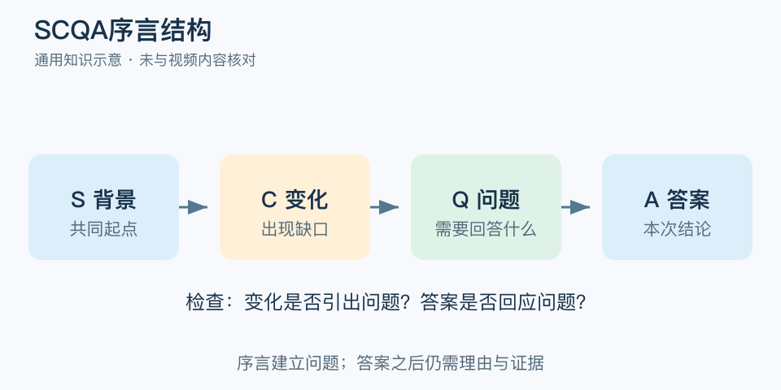

# SCQA序言结构：一分钟看懂

> 基于通用知识整理，尚未与视频内容核对。
> 内容类型：通用知识版

“我们要加两个人”是建议，读者却还不知道为什么现在需要。SCQA 用背景、变化、问题、答案建立开场，让读者知道你正在回答什么。本文采用常见的四段版本；Minto 官网使用 SCQ 来描述识别读者问题的框架，A 则是随后的回答。

- S：双方可接受的背景，够理解当前处境即可。
- C：打破原状的变化或矛盾，不必故意制造危机。
- Q：由变化自然引出的、这次必须回答的问题。
- A：直接回答该问题的判断或建议，后面还需理由与证据。

最简应用是先写读者最关心的 Q 和你的 A，再补最少的 S、C，检查四句话是否连得上。若 C 是交付延期，Q 就应聚焦如何恢复交付，而不是悄悄转成“为什么必须扩团队”。

常见误区是把所有背景堆进开头，或用强烈情绪制造冲突。顺序是帮助组织逻辑的工具，不强制每次都逐字展示四个标签。紧急汇报可以先给答案再解释背景；没有证据的建议，不会因序言顺畅就变得正确。

文字定义与适用边界参见[明细](明细.md)。

[模型主页](README.md) · [明细](明细.md) · [案例](案例.md)
