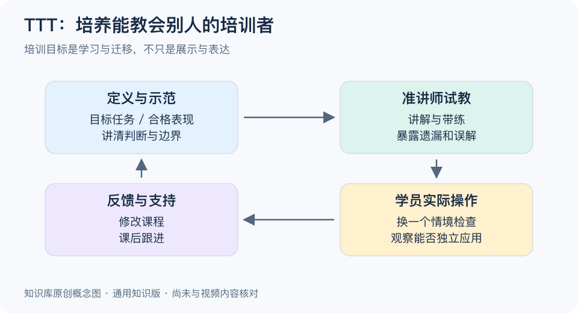

# TTT思维：一分钟看懂

> 基于通用知识整理，尚未与视频内容核对。
> 内容类型：通用知识版
> 本稿采用Train the Trainer（培训培训者）的通用语境；具体视频课程结构尚未核对，不把它当作固定三步法。

自己会做，并不代表能教会别人；教过一次，也不代表别人能把方法继续教下去。TTT在这里指培训培训者：不仅掌握主题，还要学会设计练习、观察学员表现、给反馈，让教学能够被可靠地传递。

- **先定义学会什么。** “听过概念”与“独立完成任务”不同，目标需要对应可观察行为。
- **把隐性步骤说出来。** 熟练者容易跳过关键判断，要展示为什么这么做、何时不适用。
- **让准讲师试教。** 通过实际讲解与带练发现缺口，不能只靠听讲时点头。
- **跟到真实使用。** 课后提供材料、答疑与检查机会，观察学员是否能把内容用到现场。

最简步骤：选一个小技能，写出合格表现，让准讲师示范讲解，再请听者实际操作。根据哪里卡住修改课程，然后在另一个情境中再试一次。

常见误区是把TTT缩成演讲技巧或复制一套幻灯片。声音和版式能帮助表达，但主题准确性、学习活动和反馈才决定课程能否支持学习。它也不是保证培训无限无损复制的公式，传递过程仍需持续核查。

[模型主页](README.md) · [明细](明细.md) · [案例](案例.md)
