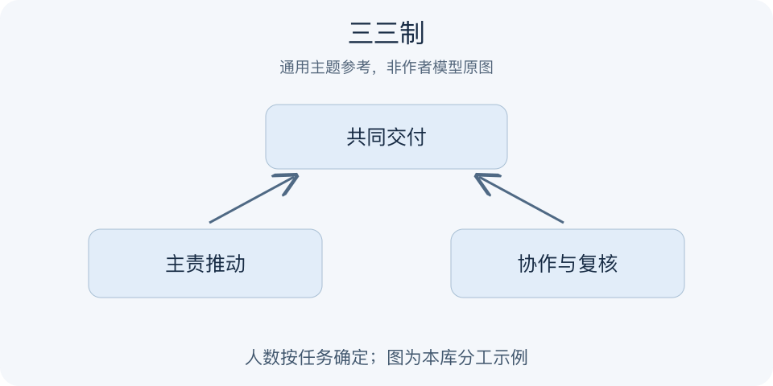

# 三三制｜一分钟看懂

> 基于通用知识整理，尚未与视频内容核对。
> 内容类型：主题参考版（原义待核实）

题名定义待核实；以下为相关主题参考，不代表该模型或作者观点。实际参考主题：小团队角色清晰、协作接口与授权。本页不复述军事战术，也不认定固定人数普适。

三个人共同负责一件事，并不会自然形成可靠协作：可能人人都在做，也可能人人都等别人。本页仅以小团队组织作参考，关注共同目标、主责、协作与复核之间的接口。目录题名涉及特定历史语境，其结构及效果尚未用文字证实，不能把这里的办法当作“三三制”原义。

- 先明确共同交付，再决定需要哪些角色。
- 主责人推动闭环，协作者提供所需输入。
- 复核关注遗漏与质量，不取代执行责任。
- 人数服从任务，沟通和授权需要显式约定。

最简做法：挑一项一周内完成的任务，写清交付物、主责人、协作输入和升级条件；结束后检查交接是否完整。三种职责可以由不同人数承担，不需要机械凑成三人。误区是用编组名称代替训练、资料共享和复盘，或认为小组越多组织就越灵活。

可以先检查一次交接：接收者是否知道要拿到什么、何时拿到、发现缺项联系谁？这比要求大家记住某个组织口号更容易验证。

---

[来源入口](README.md) · [明细](明细.md) · [案例](案例.md)
