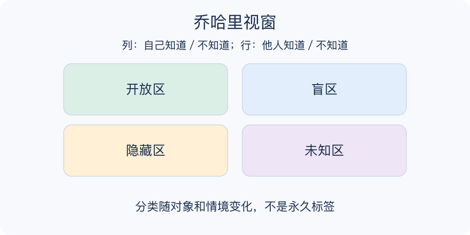

# 乔哈里视窗：一分钟看懂

> 基于通用知识整理，尚未与视频内容核对。
> 内容类型：通用知识版

**版本与边界：** 采用自我知晓与他人知晓两轴的通用乔哈里视窗；格子描述特定关系中的信息，不是永久人格分类。

你以为自己只是说话直接，同事却感到你常打断讨论。乔哈里视窗用“自己是否知道”和“别人是否知道”两条轴，把与自我相关的信息分成开放、盲区、隐藏和未知四部分，帮助双方找到沟通缺口。

- 开放区：自己和别人都知道，可作为合作的共同基础。
- 盲区：别人观察到而自己未觉察，需要具体反馈。
- 隐藏区：自己知道但尚未分享，披露程度由本人决定。
- 未知区：双方尚未发现，可通过新任务和反思逐渐探索。

选一个具体合作情境，请可信任的人举出一个行为例子，核对当时背景，再自愿补充与任务有关的信息，约定下次观察什么。

扩大开放区不等于公开所有隐私；别人的评价也不自动是真相。先核实可观察行为，再决定是否调整，不能把匿名标签当心理诊断。

练习结束应留下一条经过核对的观察与一个小调整，例如先等对方说完再回应。不要以收到多少评价或披露多少秘密作为完成标准，反馈质量比格子大小更重要。

文字依据见[明细的参考资料](明细.md#文字参考)。

[模型主页](README.md) · [一分钟看懂](一分钟看懂.md) · [明细](明细.md) · [案例](案例.md)
