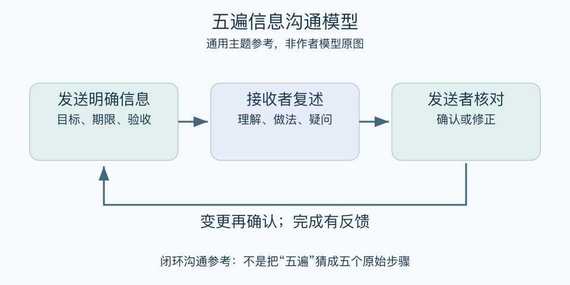

# 五遍信息沟通模型：一分钟看懂

> 基于通用知识整理，尚未与视频内容核对。
> 内容类型：主题参考版（原义待核实）

> 题名定义待核实；以下为相关主题参考，不代表该模型或作者观点。本稿参考主题：闭环沟通与任务确认。

“我已经说了”与“对方准确理解并能执行”之间还有距离。本页采用闭环沟通作为同主题参考：发出明确信息，让接收者复述关键含义，再由发送者确认或纠正。这里不把“五遍”推断为某套未经核实的五步法。

- 先说明任务、对象、期限与验收结果。
- 复述要用自己的话，暴露理解差异。
- 发送者承担确认责任，不能把误解全推给接收者。
- 重要变更重新确认，完成后反馈结果。

最简用法：把“尽快整理一下”改成具体交付要求；请对方说明准备怎么做、何时交；双方当场修正歧义。对有风险的口头信息，可留下简短文字记录。其目的不是重复次数多，而是信息含义得到共同确认。

误区是机械背诵原话，或把复述当作服从测试。对方提出疑问可能说明指令有问题；闭环沟通需要允许纠错。它也不能弥补权限不足、任务不合理或资源缺失。

[模型主页](README.md) · [明细](明细.md) · [案例](案例.md)
