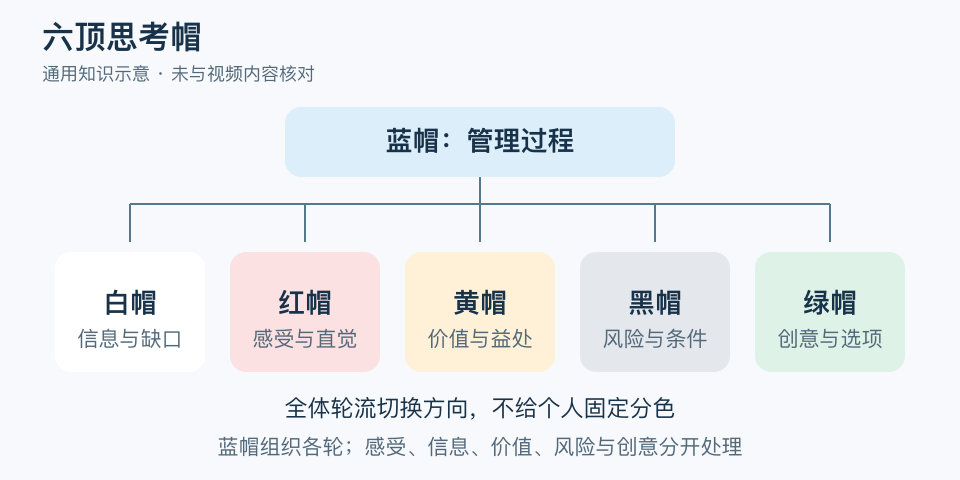

# 六顶思考帽：一分钟看懂

> 基于通用知识整理，尚未与视频内容核对。
> 内容类型：通用知识版

会议里，有人刚提方案，有人就说危险，另一个人觉得很兴奋，大家其实在做不同的思考工作。六顶思考帽由 Edward de Bono 提出，通过暂时统一思考方向，让信息、感受、价值、风险和创意轮流得到处理。

- 白帽看已知信息与缺口；红帽表达感受和直觉。
- 黄帽寻找价值与可行理由；黑帽检查风险、困难和条件。
- 绿帽产生替代做法；蓝帽管理问题、顺序、时间和收束。
- 帽子是可以切换的思考任务，不是给人贴性格标签。

最简应用：蓝帽先定一个明确问题，安排几轮限时讨论。每轮让所有人采用同一方向，记录内容后再切换；结尾由蓝帽整理选择、待核实项和下一步。顺序可按任务设计，不必机械背诵颜色。

常见误区是指定某人永远唱反调、某人永远提创意。那会固化阵营。黑帽也不等于随意否定，应说出可能出错的机制；红帽表达的感受值得听见，但不能自动变成对他人动机的事实判断。

文字定义与适用边界参见[明细](明细.md)。

[模型主页](README.md) · [明细](明细.md) · [案例](案例.md)
