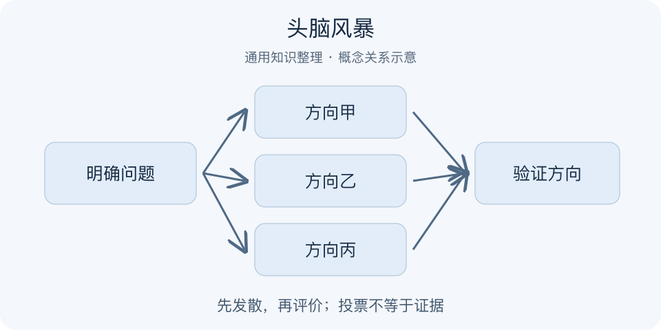

# 头脑风暴｜一分钟看懂

> 基于通用知识整理，尚未与视频内容核对。
> 内容类型：通用知识版

采用延迟评价、扩展想法、相互启发的通用创意协作方法，不宣称集体口头讨论总优于独立思考。

会议刚有人提出不成熟想法，就被一句“做不到”打断，往往只剩下安全但相似的答案。头脑风暴把提出想法与评估想法分开，先围绕明确问题扩展候选，再按标准收敛。目标是增加可探索的方向，不是证明现场最受欢迎的点子已经可行。

- 发散阶段暂缓评价，允许不成熟的方向。
- 保持问题边界，避免任意聊天。
- 在他人想法上补充、组合，不争夺所有权。
- 另设评估与验证阶段，把点子转成行动。

最简做法：明确一个问题，先安静独写，再轮流展示和补充，最后依影响、成本和不确定性筛选，指定一个小试验。这个流程是本库建议，并非固定时长定律。误区是让领导先定调、只听最会说话的人，或把“暂不批评”延伸成之后也不能质疑。点子数量只是过程信息，不能替代质量验证。

结束前检查是否留下至少一种与主流想法机制不同的候选。全部方案只是同一方向换措辞，说明发散可能还没有触及问题本身。

---

[来源入口](README.md) · [明细](明细.md) · [案例](案例.md)
