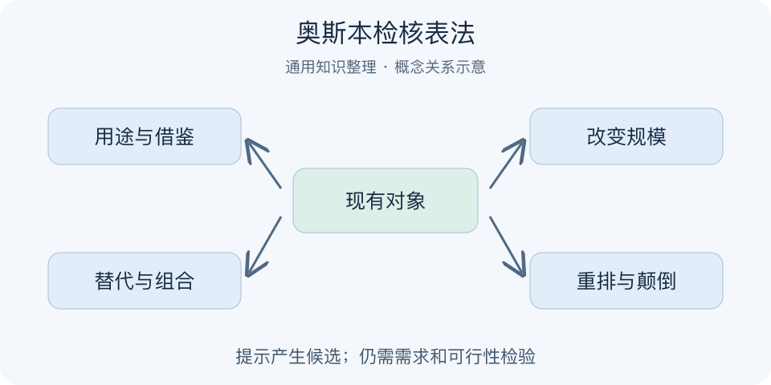

# 奥斯本检核表法｜一分钟看懂

> 基于通用知识整理，尚未与视频内容核对。
> 内容类型：通用知识版

采用奥斯本问题检核表的通用创意提示：另作他用、借鉴、修改、扩大、缩小、替代、重排、颠倒、组合；译法和分组存在差异。

改进一个水杯，只问“还能有什么创意”常会卡住。奥斯本检核表给现有对象施加不同变化问题：能否替代材料、缩小体积、改变顺序、反过来用，或与别的功能组合？它用具体提问帮助打破惯常联想，产物是候选方向，不是自动成立的好设计。

- 先选清楚要改的对象、目的和限制。
- 从用途、属性、规模、组成与顺序等方面发问。
- 允许把多个变化组合，但记录改变的原因。
- 每个方向还要检查需要、可行性和代价。

最简做法：画出现有对象，选择三类变化各写几种可能，再挑一项做样例并请使用者尝试。九类问题不必每次填满，也不是必须按顺序执行。误区是为了创新而无目标地叠加功能，或把后来的SCAMPER七字母版本与奥斯本原检核表逐项等同；两者有关联，但分组与历史不能混写。

同一提示可能产生好坏不同的答案。记录“为什么值得试”比标注“属于第几类创新”更有价值，类别只负责帮助开始思考。

---

[来源入口](README.md) · [明细](明细.md) · [案例](案例.md)
