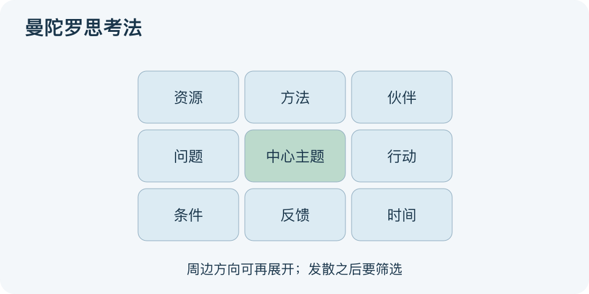

# 曼陀罗思考法：一分钟看懂

> 基于通用知识整理，尚未与视频内容核对。
> 内容类型：通用知识版

围绕一个目标想到很多点，却总绕回同一角度，可以试用九宫格。本文采用松村宁雄相关Mandala Chart的通用九宫格版本：中心放主题，周围放相关方向，必要时再将某一方向展开成新九宫格；不能认定与视频步骤完全一致。

- 中心写具体问题，避免同时放几个互不相关的目标。
- 周围格子帮助发散角度，不代表必须有八个同等重要因素。
- 每格可先写问题或线索，未知处可以留空待查。
- 发散后必须筛选，落实到行动、负责人或验证任务。

最简应用：把本月要解决的问题放中间，写出若干相关因素，挑一个最值得调查的方向再展开；最后只选少数行动。图用中心主题与周边方向表示关联，位置没有天然的重要性排序。

误区是填满八格就算分析完整，或者画到八十一格就认定计划更好。格子提供外部提示，不证明条目之间存在因果，也不能替代事实调查。若重复项很多或问题越来越模糊，先合并和重写中心主题，再决定是否继续展开。

文字依据和适用边界见[明细](明细.md)。

[模型主页](README.md) · [明细](明细.md) · [案例](案例.md)
