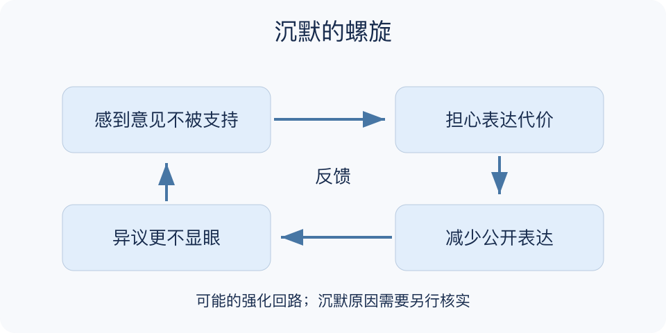

# 沉默的螺旋：一分钟看懂

> 基于通用知识整理，尚未与视频内容核对。
> 内容类型：通用知识版

**版本与边界：** 采用Noelle-Neumann的公众意见表达理论；它描述可能发生的社会机制，不意味着所有沉默都由从众或恐惧造成。

群里先出现几条支持意见，其他人没有回应，管理员便说“大家一致同意”。沉默的螺旋提醒我们：人们感到自己的看法不被支持时，可能因为担心孤立而少说；少说又让该看法更不显眼，进一步影响他人对意见气候的判断。

- 感知多数不等于真实多数：可见声音受到发言频率和渠道影响。
- 表达与信念不同：少说不必然表示观点已经改变。
- 反馈可能自我加强：越少看见异议，越容易误判没有异议。
- 环境可以打断循环：安全反馈渠道和公平回应能降低表达顾虑。

遇到“没人反对”的结论，先分开记录可见发言与实际意见，再用不诱导、能保护隐私的方式征求不同看法，检查是否存在表达代价。

不能把任何安静的人解释为被压制，也不能反过来认定少数意见更正确。模型讨论表达环境，不替某一立场提供事实证明。

最小产物不是一张多数立场排行榜，而是一份说明已知与未知的意见摘要：谁有机会表达，哪些看法实际出现，哪些人尚未回应，以及现有渠道可能漏掉什么。

文字依据见[明细的参考资料](明细.md#文字参考)。

[模型主页](README.md) · [一分钟看懂](一分钟看懂.md) · [明细](明细.md) · [案例](案例.md)
