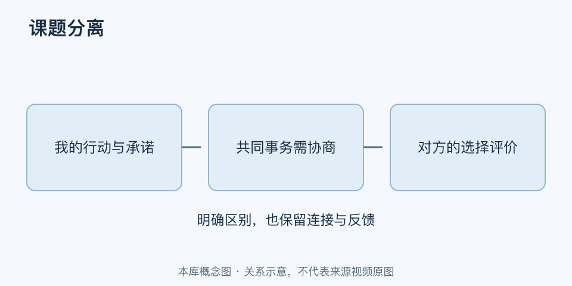

# 课题分离｜一分钟看懂

> 基于通用知识整理，尚未与视频内容核对。
> 内容类型：通用知识版

[返回主题](README.md) · [明细](明细.md) · [案例](案例.md)

朋友不赞同你的选择，你可以认真解释，却不能直接决定他最后是否赞同。课题分离借“谁做决定、谁承担相应后果”帮助识别人际边界。本稿采用《被讨厌的勇气》传播的阿德勒取向自助语境，不把它视为心理治疗的通用处方。

- 我能负责自己的表达、承诺和行动，不能保证他人的评价。
- 尊重对方选择，不等于撤掉必要支持或故意冷漠。
- 共同事务需要协商责任，不能简单切成互不相关的两半。
- 已经作出的承诺与应承担的照护、工作责任，不会因一句“你的课题”而消失。

最简做法：写下当前冲突，分出自己的行动、对方的选择与共同决定；表达可提供的支持和不能代替的部分，再约定沟通方式。例如“我可以一起查资料，最终专业选择由你决定”。

不要用它指责受伤的人“情绪是你自己的事”，也不要替别人做完决定再要求他承担后果。边界应增加清楚与合作，而不是掩盖权力差异或逃避修复伤害。
