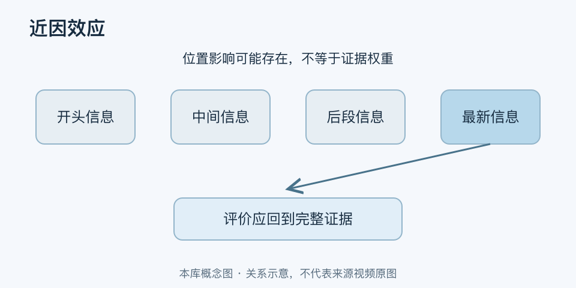

# 近因效应｜一分钟看懂

> 基于通用知识整理，尚未与视频内容核对。
> 内容类型：通用知识版

[返回主题](README.md) · [明细](明细.md) · [案例](案例.md)

季度绩效回顾时，最近一周的失误可能压过此前几个月的工作；刚读完一串项目，也可能更容易记得结尾部分。近因效应指较晚、较近的信息对记忆或评价产生较大影响。本稿区分序列记忆与社会评价，不声称每种场景都由同一机制决定。

- 新鲜的信息容易被提取，但新鲜不等于代表性强。
- 结尾值得认真安排，关键结论与下一步应清楚。
- 较早贡献、缓慢变化和中间材料容易在回顾中被漏掉。
- 延迟、干扰、复习与信息类型都会影响近因优势。

最简做法：回顾时先确定完整时间窗，再调取期间记录；汇报时在结尾重申结论、责任人与期限。学习时合上材料做全范围回忆，别只重复刚看到的末尾。

不要把“最后一次表现”当成整体能力，也不要仅为冲刺末期指标改变长期工作。近因效应提供了一个偏差检查方向；它不能证明最近的证据必须降权。如果新信息确实反映环境改变，也应该据其质量及时更新判断。
